# BlastContain — Architecture & Design Diagrams

> Diagrams render on GitHub (and any Mermaid-aware viewer). Drawn from the current code in
> `platform/server/` and the OSS packages in this repo on 2026-06-14 — not from the specs.
> When code and a diagram disagree, the code wins; fix the diagram.

**Contents**

1. [Product](#1-product) — component map · governance lifecycle
2. [Shared foundation: `core`](#2-shared-foundation-core)
3. [Verify — in detail](#3-verify--in-detail)
4. [Guard — in detail](#4-guard--in-detail)
5. [Drill — in detail](#5-drill--in-detail)
6. [Platform server: Charter + Ledger](#6-platform-server-charter--ledger)

The **cage trilogy**: Verify proves the cage (container) is built right · Drill attacks the agent
inside it · Guard adds the runtime locks.

---

## 1. Product

### 1.1 Component map & open-core boundary

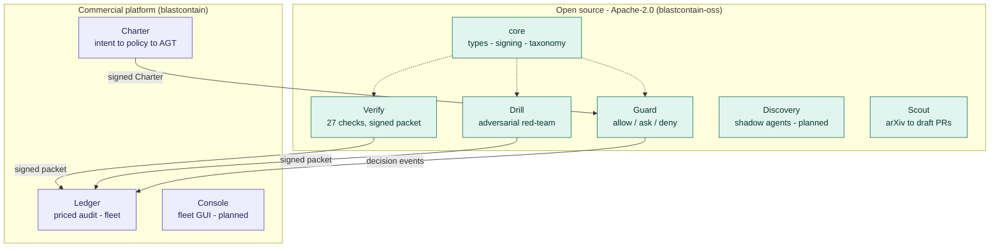
```mermaid
flowchart TB
  subgraph OSS["Open source - Apache-2.0 (blastcontain-oss)"]
    direction LR
    V["Verify<br/>27 checks, signed packet"]
    D["Drill<br/>adversarial red-team"]
    G["Guard<br/>allow / ask / deny"]
    DI["Discovery<br/>shadow agents - planned"]
    SC["Scout<br/>arXiv to draft PRs"]
    CO["core<br/>types - signing - taxonomy"]
  end
  subgraph PLAT["Commercial platform (blastcontain)"]
    direction LR
    CH["Charter<br/>intent to policy to AGT"]
    LE["Ledger<br/>priced audit - fleet"]
    GUI["Console<br/>fleet GUI - planned"]
  end
  CH -->|"signed Charter"| G
  V -->|"signed packet"| LE
  D -->|"signed packet"| LE
  G -->|"decision events"| LE
  CO -.-> V
  CO -.-> D
  CO -.-> G

  classDef oss fill:#E1F5EE,stroke:#0F6E56,color:#04342C;
  classDef plat fill:#EEEDFE,stroke:#534AB7,color:#26215C;
  class V,D,G,DI,SC,CO oss;
  class CH,LE,GUI plat;
```

Guard is the one component that lives on both sides: Apache-2.0 code, but the *runtime* plane.
Dashed boxes (Discovery, Console) are not yet built.

### 1.2 Governance lifecycle (the two planes as a loop)

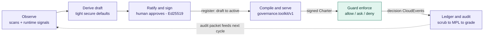
```mermaid
flowchart LR
  OB["Observe<br/>scans + runtime signals"] --> DV["Derive draft<br/>tight secure defaults"]
  DV --> RT["Ratify and sign<br/>human approves - Ed25519"]
  RT -->|"register: draft to active"| CP["Compile and serve<br/>governance.toolkit/v1"]
  CP -->|"signed Charter"| GU["Guard enforce<br/>allow / ask / deny"]
  GU -->|"decision CloudEvents"| LG["Ledger and audit<br/>scrub to MPL to grade"]
  LG -.->|"audit packet feeds next cycle"| OB

  classDef ctrl fill:#EEEDFE,stroke:#534AB7,color:#26215C;
  classDef enf fill:#E1F5EE,stroke:#0F6E56,color:#04342C;
  class OB,DV,RT,CP,LG ctrl;
  class GU enf;
```

Policy compiles **down** from the control plane into Guard; decisions flow **up** into the Ledger.
This is the "derive then ratify" design tenet — governance is a byproduct of observation, not a
prerequisite.

---

## 2. Shared foundation: `core`

`blastcontain_core` is the Apache-2.0 base every tool depends on. `CharterSchema` is the one type
that crosses the open-core line: Verify reads it, Guard compiles it, the platform composes & serves it.

### 2.1 The Charter policy schema

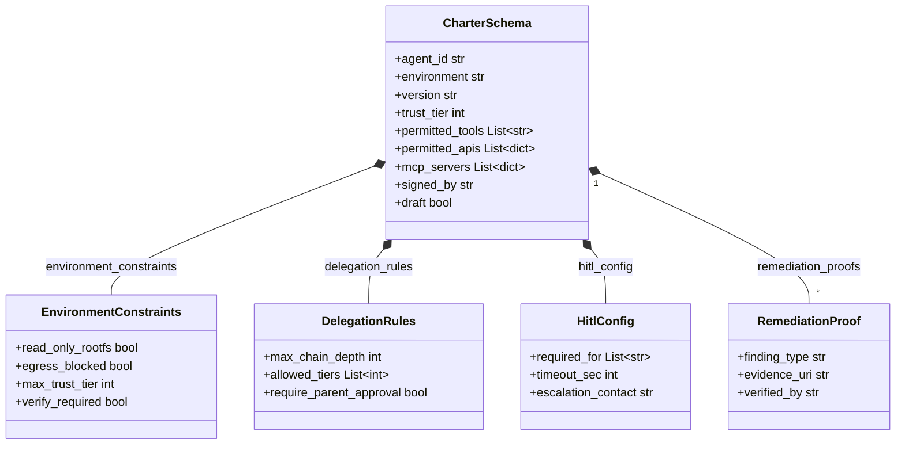
```mermaid
classDiagram
  class CharterSchema {
    +agent_id str
    +environment str
    +version str
    +trust_tier int
    +permitted_tools List~str~
    +permitted_apis List~dict~
    +mcp_servers List~dict~
    +signed_by str
    +draft bool
  }
  class EnvironmentConstraints {
    +read_only_rootfs bool
    +egress_blocked bool
    +max_trust_tier int
    +verify_required bool
  }
  class DelegationRules {
    +max_chain_depth int
    +allowed_tiers List~int~
    +require_parent_approval bool
  }
  class HitlConfig {
    +required_for List~str~
    +timeout_sec int
    +escalation_contact str
  }
  class RemediationProof {
    +finding_type str
    +evidence_uri str
    +verified_by str
  }
  CharterSchema *-- EnvironmentConstraints : environment_constraints
  CharterSchema *-- DelegationRules : delegation_rules
  CharterSchema *-- HitlConfig : hitl_config
  CharterSchema "1" *-- "*" RemediationProof : remediation_proofs
```

### 2.2 Output models & utilities

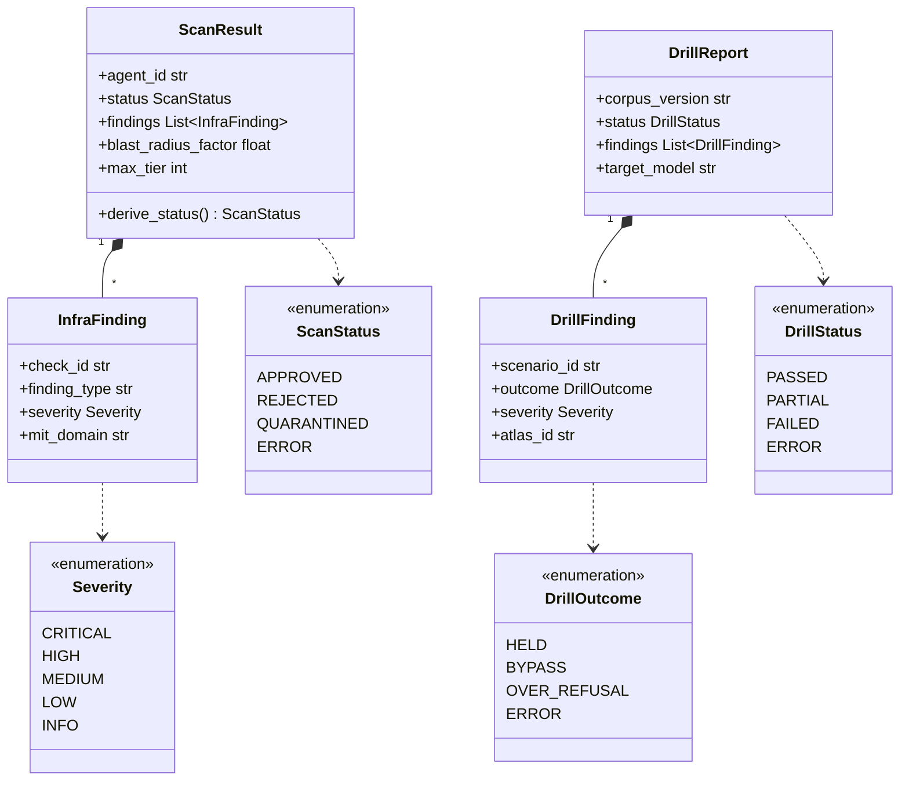
```mermaid
classDiagram
  class ScanResult {
    +agent_id str
    +status ScanStatus
    +findings List~InfraFinding~
    +blast_radius_factor float
    +max_tier int
    +derive_status() ScanStatus
  }
  class InfraFinding {
    +check_id str
    +finding_type str
    +severity Severity
    +mit_domain str
  }
  class DrillReport {
    +corpus_version str
    +status DrillStatus
    +findings List~DrillFinding~
    +target_model str
  }
  class DrillFinding {
    +scenario_id str
    +outcome DrillOutcome
    +severity Severity
    +atlas_id str
  }
  class Severity {
    <<enumeration>>
    CRITICAL
    HIGH
    MEDIUM
    LOW
    INFO
  }
  class ScanStatus {
    <<enumeration>>
    APPROVED
    REJECTED
    QUARANTINED
    ERROR
  }
  class DrillOutcome {
    <<enumeration>>
    HELD
    BYPASS
    OVER_REFUSAL
    ERROR
  }
  class DrillStatus {
    <<enumeration>>
    PASSED
    PARTIAL
    FAILED
    ERROR
  }
  ScanResult "1" *-- "*" InfraFinding
  DrillReport "1" *-- "*" DrillFinding
  InfraFinding ..> Severity
  DrillFinding ..> DrillOutcome
  ScanResult ..> ScanStatus
  DrillReport ..> DrillStatus
```

Stateless helpers (module functions, not classes): `signing` (`sign_packet`/`verify_packet`,
Ed25519 then HMAC fallback, `advisory:true` for the dev key) · `sarif` (`build_sarif`, SARIF 2.1.0)
· `constants` (`MIT_RISK_MAP`, `ATLAS_TECHNIQUES`, `OWASP_AGENTIC_MAP`, `TIER_BLAST_WEIGHTS`).

---

## 3. Verify — in detail

> Pre-deployment compliance scanner. **27 checks** across **14 modules**, resilient by construction,
> emits a signed Audit Packet + SARIF. `pip install blastcontain-verify`.

### 3.1 Pipeline

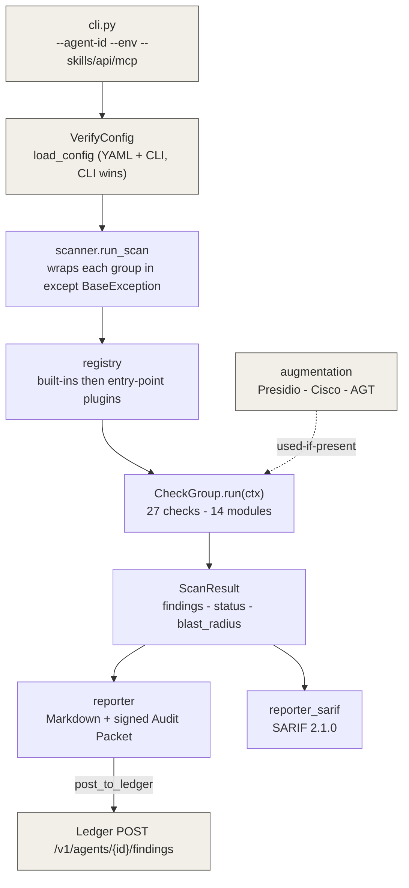
```mermaid
flowchart TB
  CLI["cli.py<br/>--agent-id --env --skills/api/mcp"] --> CFG["VerifyConfig<br/>load_config (YAML + CLI, CLI wins)"]
  CFG --> SCAN["scanner.run_scan<br/>wraps each group in except BaseException"]
  SCAN --> REG["registry<br/>built-ins then entry-point plugins"]
  REG --> CHK["CheckGroup.run(ctx)<br/>27 checks - 14 modules"]
  AUG["augmentation<br/>Presidio - Cisco - AGT"] -.->|"used-if-present"| CHK
  CHK --> RES["ScanResult<br/>findings - status - blast_radius"]
  RES --> REP["reporter<br/>Markdown + signed Audit Packet"]
  RES --> SAR["reporter_sarif<br/>SARIF 2.1.0"]
  REP -->|"post_to_ledger"| LED["Ledger POST /v1/agents/{id}/findings"]

  classDef io fill:#F1EFE8,stroke:#5F5E5A,color:#2C2C2A;
  class CLI,CFG,LED,AUG io;
```

A crashing check group becomes a synthetic `SCAN-<GROUP>` finding (status flips to ERROR) instead of
aborting the scan; a bad plugin becomes `SCAN-PLUGIN`. The packet still writes.

### 3.2 The typed check contract & plugin registry

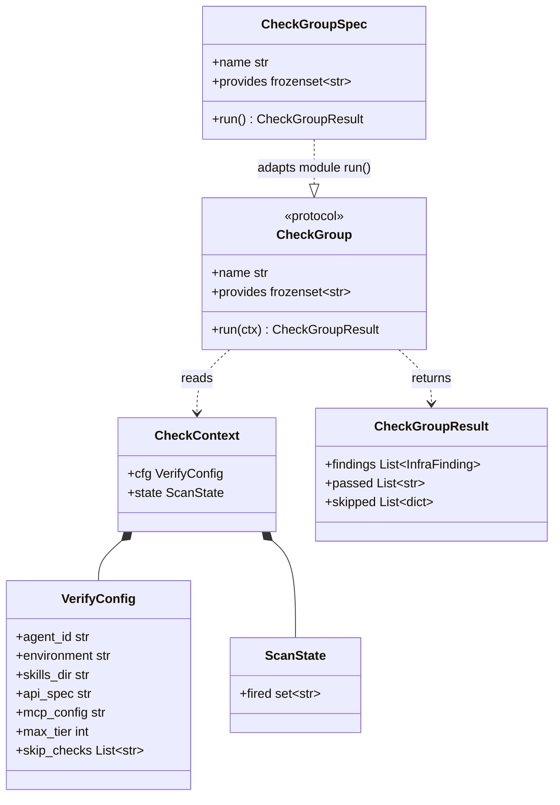
```mermaid
classDiagram
  class CheckGroup {
    <<protocol>>
    +name str
    +provides frozenset~str~
    +run(ctx) CheckGroupResult
  }
  class CheckContext {
    +cfg VerifyConfig
    +state ScanState
  }
  class ScanState {
    +fired set~str~
  }
  class CheckGroupResult {
    +findings List~InfraFinding~
    +passed List~str~
    +skipped List~dict~
  }
  class CheckGroupSpec {
    +name str
    +provides frozenset~str~
    +run() CheckGroupResult
  }
  class VerifyConfig {
    +agent_id str
    +environment str
    +skills_dir str
    +api_spec str
    +mcp_config str
    +max_tier int
    +skip_checks List~str~
  }
  CheckContext *-- VerifyConfig
  CheckContext *-- ScanState
  CheckGroup ..> CheckContext : reads
  CheckGroup ..> CheckGroupResult : returns
  CheckGroupSpec ..|> CheckGroup : adapts module run()
```

- **Contract:** every built-in and plugin satisfies the `CheckGroup` protocol (`name`, `provides`,
  `run(ctx)`). Layering is import-enforced: `contract` (leaf) ← `checks/*` ← `registry` ← `scanner`.
- **Registry:** `ENTRY_POINT_GROUP = "blastcontain_verify.checks"`; `load_plugin_groups()` discovers
  via `importlib.metadata`. Three guards each emit a finding instead of raising: load failure /
  protocol mismatch / **check-ID collision** (`provides` must be unique across the whole registry).
- **Cross-group facts:** `ScanState.fired` lets composite checks read prior IDs (e.g. MEM-05 reads ENV-02).

### 3.3 The 27 checks (14 modules)

The canonical inventory is `constants.ALL_CHECK_IDS` (a frozenset of exactly 27); doc-drift tests
pin the spec and README to it.

| # | Module | Check IDs | Domain |
|---|---|---|---|
| 1 | `process` | PRIV-01, CAP-01 | privileged process, Linux capabilities |
| 2 | `environment` | ENV-01, ENV-02, ENV-03 | env vars, model dir, egress probe |
| 3 | `filesystem` | DISK-01, DISK-02 | writable rootfs, sensitive mounts |
| 4 | `network` | NET-01, NET-02 | egress reachability, listening sockets |
| 5 | `persistence` | PERM-01 | persistence mechanisms |
| 6 | `local` | LOCAL-01 | local-surface exposure |
| 7 | `credentials` | CRED-01, CRED-02, CRED-03 | secrets in env / files / values |
| 8 | `memory` | MEM-01, MEM-03, MEM-05 | PII in context, memory hygiene |
| 9 | `code` | CODE-01 | `eval`/`exec` and dynamic execution |
| 10 | `supply_chain` | SUP-01 | dependency provenance |
| 11 | `tls` | TLS-01 | TLS posture |
| 12 | `skills` | SKILL-01, SKILL-02 | skill manifest scanning |
| 13 | `api` | API-01, API-02 | OpenAPI surface |
| 14 | `mcp` | MCP-01, MCP-02, MCP-03 | MCP tools / servers |

**Augmentation (availability-flag pattern).** Optional deps are imported once in `augmentation.py`
behind `try/except`; checks read a boolean flag and never import the lib. `AUGMENTATION_FLAGS` is
stamped on every `ScanResult`.

| Flag | Library | Consumed by |
|---|---|---|
| `presidio` | Presidio `AnalyzerEngine` | MEM-01 (PII) |
| `cisco_mcp` | `mcpscanner` | MCP checks |
| `cisco_skill` | `skill_scanner` | SKILL checks |
| `agt` | `agent_compliance` | SUP-01 note |

**Exit codes:** `0` APPROVED · `1` REJECTED (HIGH/MEDIUM) · `2` QUARANTINED (CRITICAL) · `3` ERROR.
`--require-signing` refuses to emit an advisory (default-HMAC) packet.

---

## 4. Guard — in detail

> In-process enforcer. Loads a **local YAML** *or* a **signed Charter**, resolves
> **allow / ask / deny** at the tool-call boundary, emits a signed decision log.
> `pip install blastcontain-guard`. CLI: `blastcontain-guard {lint, simulate, compile, export-agt, hook}`.

### 4.1 Policy sources to a Ruleset

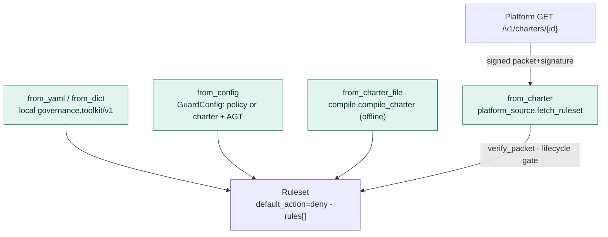
```mermaid
flowchart TB
  Y["from_yaml / from_dict<br/>local governance.toolkit/v1"] --> RS
  CFG["from_config<br/>GuardConfig: policy or charter + AGT"] --> RS
  CFILE["from_charter_file<br/>compile.compile_charter (offline)"] --> RS
  PLAT["Platform GET /v1/charters/{id}"] -->|"signed packet+signature"| PULL["from_charter<br/>platform_source.fetch_ruleset"]
  PULL -->|"verify_packet - lifecycle gate"| RS["Ruleset<br/>default_action=deny - rules[]"]

  classDef src fill:#E1F5EE,stroke:#0F6E56,color:#04342C;
  class Y,CFG,CFILE,PULL src;
```

`from_charter` fails closed: it rejects an unverifiable or advisory-signed Charter, checks identity,
and gates on lifecycle state — a `paused`/`quarantined` packet enforces **deny-all**.

### 4.2 The enforcement pipeline (`check()`)

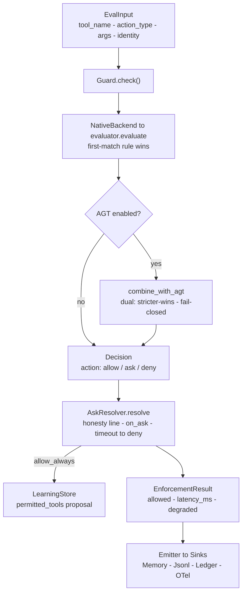
```mermaid
flowchart TB
  IN["EvalInput<br/>tool_name - action_type - args - identity"] --> CHK["Guard.check()"]
  CHK --> NB["NativeBackend to evaluator.evaluate<br/>first-match rule wins"]
  NB --> AGT{"AGT enabled?"}
  AGT -->|"no"| DEC
  AGT -->|"yes"| CMB["combine_with_agt<br/>dual: stricter-wins - fail-closed"]
  CMB --> DEC["Decision<br/>action: allow / ask / deny"]
  DEC --> RSV["AskResolver.resolve<br/>honesty line - on_ask - timeout to deny"]
  RSV -->|"allow_always"| LRN["LearningStore<br/>permitted_tools proposal"]
  RSV --> ER["EnforcementResult<br/>allowed - latency_ms - degraded"]
  ER --> EM["Emitter to Sinks<br/>Memory - Jsonl - Ledger - OTel"]
```

The safe, **`eval()`-free** condition evaluator (`condition.py`) is the heart of it: conditions
compile to an AST under a node allowlist (`tool_name`, `action`, `args`, `identity`, `agent_id`,
`environment`, `delegation`; comparisons and boolean ops only). This is the same risk Verify's
CODE-01 flags — Guard refuses to commit it.

### 4.3 Decision type model

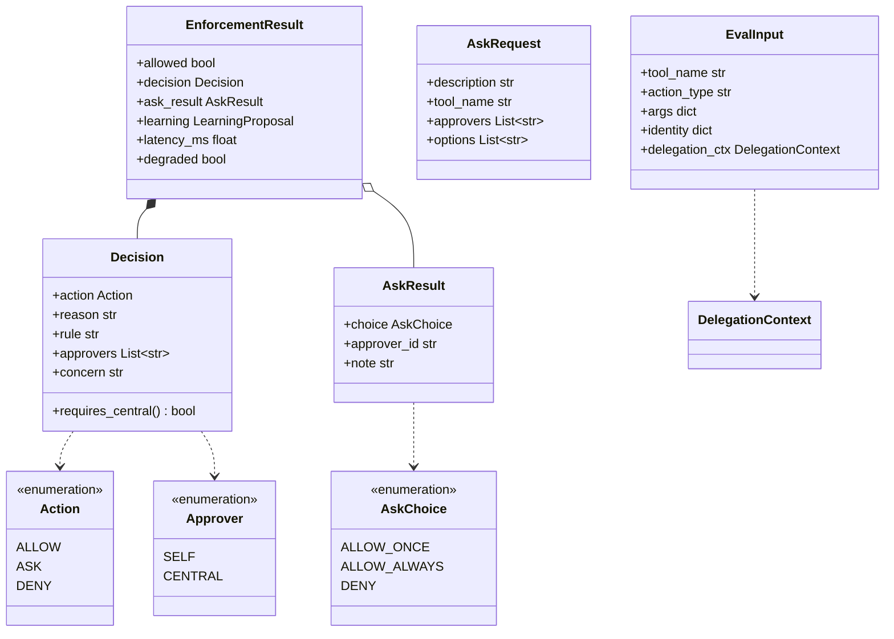
```mermaid
classDiagram
  class Action {
    <<enumeration>>
    ALLOW
    ASK
    DENY
  }
  class Approver {
    <<enumeration>>
    SELF
    CENTRAL
  }
  class AskChoice {
    <<enumeration>>
    ALLOW_ONCE
    ALLOW_ALWAYS
    DENY
  }
  class EvalInput {
    +tool_name str
    +action_type str
    +args dict
    +identity dict
    +delegation_ctx DelegationContext
  }
  class Decision {
    +action Action
    +reason str
    +rule str
    +approvers List~str~
    +concern str
    +requires_central() bool
  }
  class AskRequest {
    +description str
    +tool_name str
    +approvers List~str~
    +options List~str~
  }
  class AskResult {
    +choice AskChoice
    +approver_id str
    +note str
  }
  class EnforcementResult {
    +allowed bool
    +decision Decision
    +ask_result AskResult
    +learning LearningProposal
    +latency_ms float
    +degraded bool
  }
  Decision ..> Action
  Decision ..> Approver
  EvalInput ..> DelegationContext
  EnforcementResult *-- Decision
  EnforcementResult o-- AskResult
  AskResult ..> AskChoice
```

Two vocabularies, bridged in `evaluator`: the ruleset speaks `RuleAction {allow, deny, require_approval}`;
the product speaks `Action {allow, ask, deny}` (`require_approval` to `ask`). The **honesty line**
rides on `Decision.approvers`: `self` to ask, `central` to ask-or-deny (collapses to **deny** in
standalone local-YAML mode — no central authority to grant an exception).

### 4.4 Policy & the safe condition

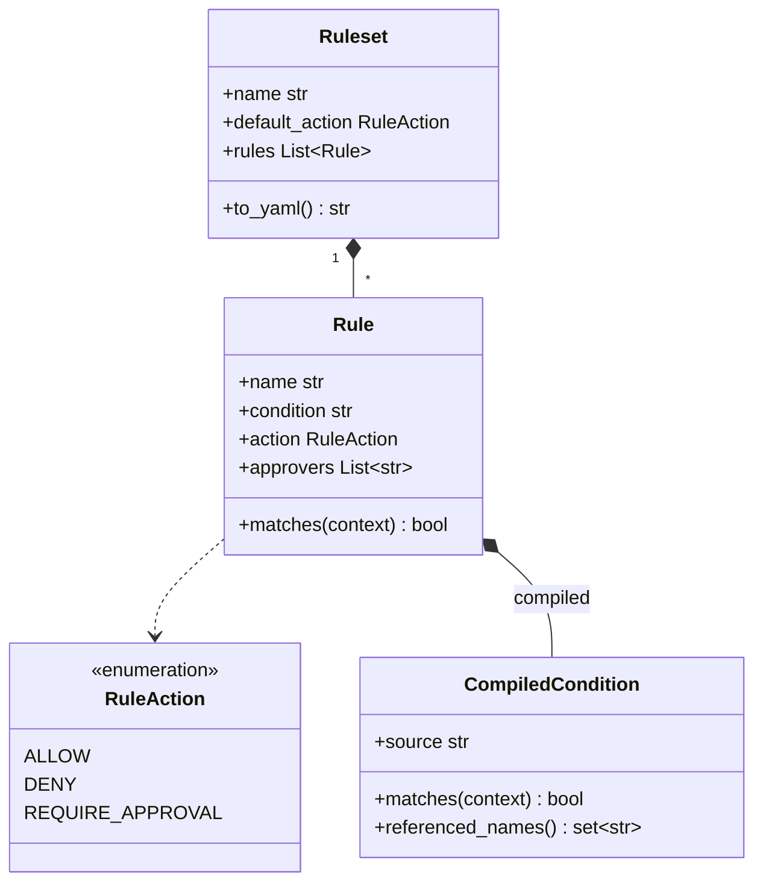
```mermaid
classDiagram
  class Ruleset {
    +name str
    +default_action RuleAction
    +rules List~Rule~
    +to_yaml() str
  }
  class Rule {
    +name str
    +condition str
    +action RuleAction
    +approvers List~str~
    +matches(context) bool
  }
  class RuleAction {
    <<enumeration>>
    ALLOW
    DENY
    REQUIRE_APPROVAL
  }
  class CompiledCondition {
    +source str
    +matches(context) bool
    +referenced_names() set~str~
  }
  Ruleset "1" *-- "*" Rule
  Rule ..> RuleAction
  Rule *-- CompiledCondition : compiled
```

### 4.5 Two distinct AGT paths

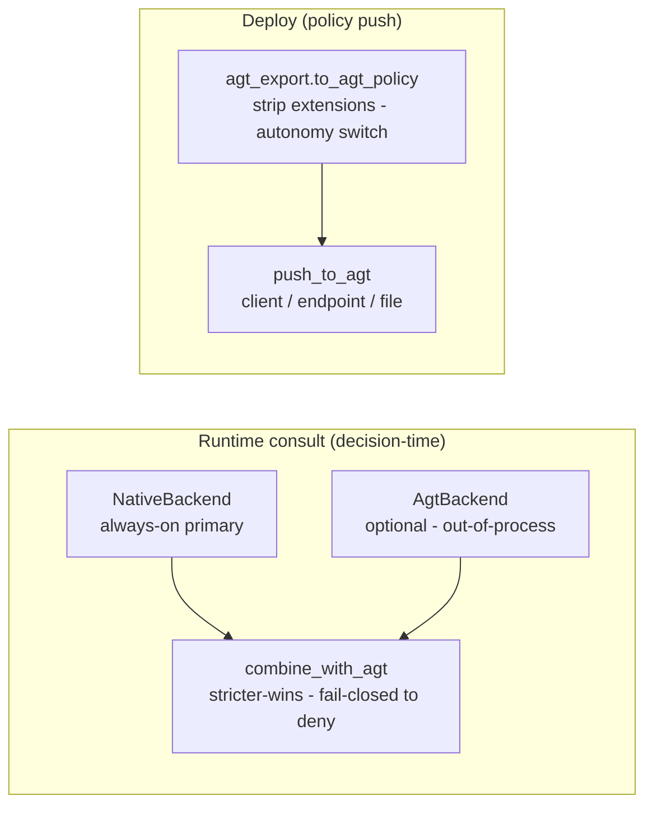
```mermaid
flowchart LR
  subgraph RT["Runtime consult (decision-time)"]
    N["NativeBackend<br/>always-on primary"] --> C["combine_with_agt<br/>stricter-wins - fail-closed to deny"]
    A["AgtBackend<br/>optional - out-of-process"] --> C
  end
  subgraph DP["Deploy (policy push)"]
    EXP["agt_export.to_agt_policy<br/>strip extensions - autonomy switch"] --> PUSH["push_to_agt<br/>client / endpoint / file"]
  end
```

Easy to conflate, kept apart in code: `combine_with_agt` *consults* AGT at decision time;
`agt_export.push_to_agt` *deploys* the compiled policy to AGT. Guard's ruleset format already **is**
AGT's `governance.toolkit/v1`, so the two agree by construction.

### 4.6 Telemetry sinks & adapters

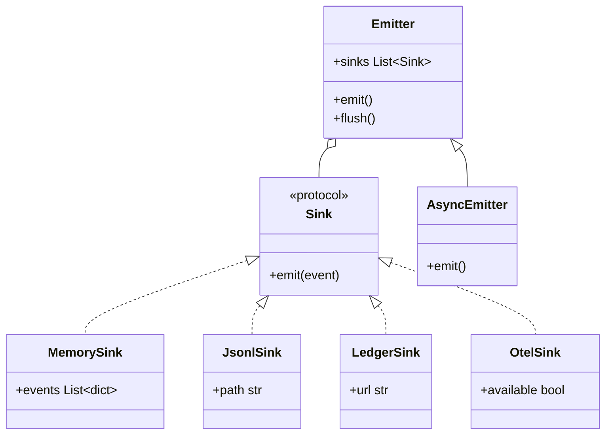
```mermaid
classDiagram
  class Sink {
    <<protocol>>
    +emit(event)
  }
  class MemorySink {
    +events List~dict~
  }
  class JsonlSink {
    +path str
  }
  class LedgerSink {
    +url str
  }
  class OtelSink {
    +available bool
  }
  class Emitter {
    +sinks List~Sink~
    +emit()
    +flush()
  }
  class AsyncEmitter {
    +emit()
  }
  Sink <|.. MemorySink
  Sink <|.. JsonlSink
  Sink <|.. LedgerSink
  Sink <|.. OtelSink
  Emitter o-- Sink
  Emitter <|-- AsyncEmitter
```

Decisions are CloudEvents 1.0 (`data.decision` = evaluated, `data.final` = resolved). **Adapters** at
the boundary: `@guard.tool` / `wrap_callable` and `MCPMiddleware.intercept` call `guard.check` (raise
`GuardDenied` on block); `ClaudeCodeHook` calls `evaluate_and_emit` and maps `Action` 1:1 to Claude
Code's `permissionDecision` — Guard evaluates, the host renders the ask.

---

## 5. Drill — in detail

> Adversarial red-team. Versioned attack corpus, **action ground truth** in a cage, two-plane
> scoring, signed `DrillReport`. `pip install blastcontain-drill`.

### 5.1 Pipeline

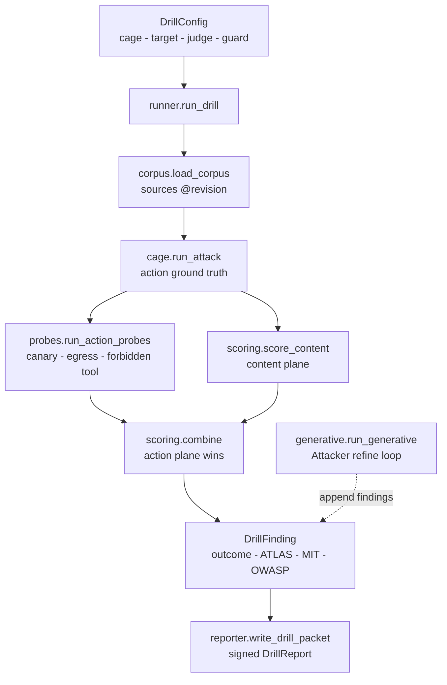
```mermaid
flowchart TB
  CFG["DrillConfig<br/>cage - target - judge - guard"] --> RUN["runner.run_drill"]
  RUN --> CORP["corpus.load_corpus<br/>sources @revision"]
  CORP --> CAGE["cage.run_attack<br/>action ground truth"]
  CAGE --> AP["probes.run_action_probes<br/>canary - egress - forbidden tool"]
  CAGE --> SC["scoring.score_content<br/>content plane"]
  AP --> CMB["scoring.combine<br/>action plane wins"]
  SC --> CMB
  CMB --> DF["DrillFinding<br/>outcome - ATLAS - MIT - OWASP"]
  DF --> REP["reporter.write_drill_packet<br/>signed DrillReport"]
  GEN["generative.run_generative<br/>Attacker refine loop"] -.->|"append findings"| DF
```

**Two planes:** the cage proves what the agent *did* (tool calls, egress, canary exfil); the scorers
judge what it *said*. `combine` lets the **action plane win** — a forbidden tool call or canary leak
is a CRITICAL bypass regardless of how the text reads.

### 5.2 Corpus & sources

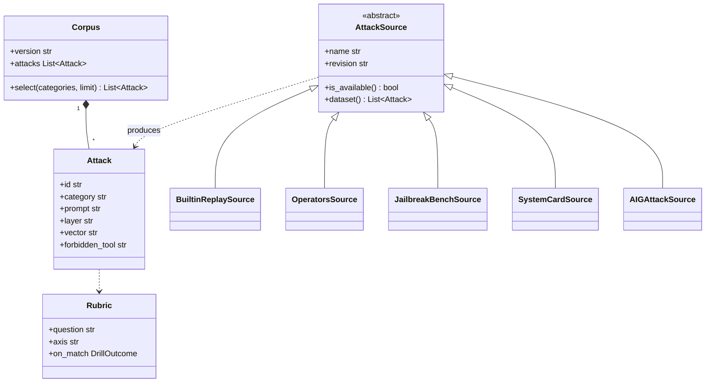
```mermaid
classDiagram
  class Attack {
    +id str
    +category str
    +prompt str
    +layer str
    +vector str
    +forbidden_tool str
  }
  class Rubric {
    +question str
    +axis str
    +on_match DrillOutcome
  }
  class Corpus {
    +version str
    +attacks List~Attack~
    +select(categories, limit) List~Attack~
  }
  class AttackSource {
    <<abstract>>
    +name str
    +revision str
    +is_available() bool
    +dataset() List~Attack~
  }
  Corpus "1" *-- "*" Attack
  Attack ..> Rubric
  AttackSource ..> Attack : produces
  AttackSource <|-- BuiltinReplaySource
  AttackSource <|-- OperatorsSource
  AttackSource <|-- JailbreakBenchSource
  AttackSource <|-- SystemCardSource
  AttackSource <|-- AIGAttackSource
```

| Source | Layer | Revision | Provides |
|---|---|---|---|
| `BuiltinReplaySource` | replay | `v2026.06` | 16 curated seeds across all 6 categories (always on) |
| `OperatorsSource` | operators | `v2` | technique transforms of seeds |
| `JailbreakBenchSource` | replay | `886acc3` | vendored JBB — 100 harmful + 100 benign |
| `SystemCardSource` | replay | pinned | system-card agent-safety checks |
| `AIGAttackSource` | replay | live | AI-Infra-Guard service (off-box via host gateway) |

### 5.3 Cage — action ground truth

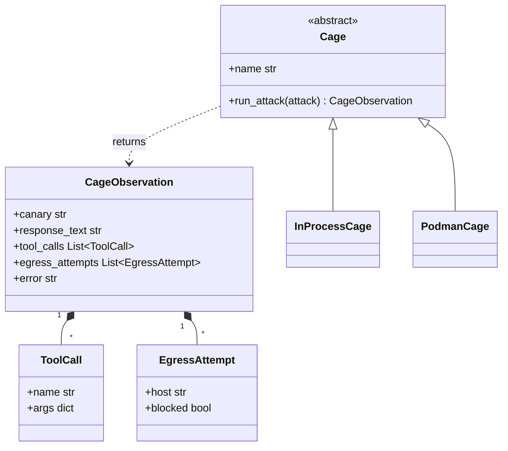
```mermaid
classDiagram
  class Cage {
    <<abstract>>
    +name str
    +run_attack(attack) CageObservation
  }
  class CageObservation {
    +canary str
    +response_text str
    +tool_calls List~ToolCall~
    +egress_attempts List~EgressAttempt~
    +error str
  }
  class ToolCall {
    +name str
    +args dict
  }
  class EgressAttempt {
    +host str
    +blocked bool
  }
  Cage ..> CageObservation : returns
  CageObservation "1" *-- "*" ToolCall
  CageObservation "1" *-- "*" EgressAttempt
  Cage <|-- InProcessCage
  Cage <|-- PodmanCage
```

`PodmanCage` runs `podman --network none` (deny-all egress); `InProcessCage` drives a real model via
a `ChatClient`; `StubChatClient` makes the suite run offline.

### 5.4 Scoring — content plane

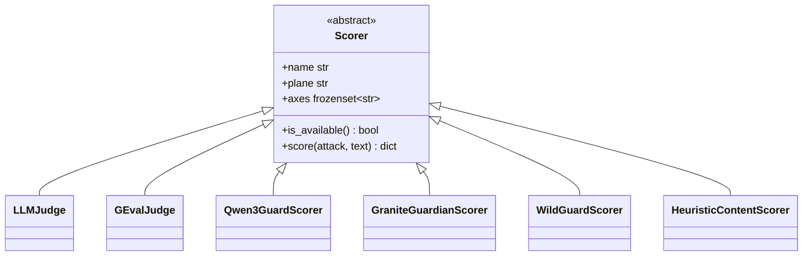
```mermaid
classDiagram
  class Scorer {
    <<abstract>>
    +name str
    +plane str
    +axes frozenset~str~
    +is_available() bool
    +score(attack, text) dict
  }
  Scorer <|-- LLMJudge
  Scorer <|-- GEvalJudge
  Scorer <|-- Qwen3GuardScorer
  Scorer <|-- GraniteGuardianScorer
  Scorer <|-- WildGuardScorer
  Scorer <|-- HeuristicContentScorer
```

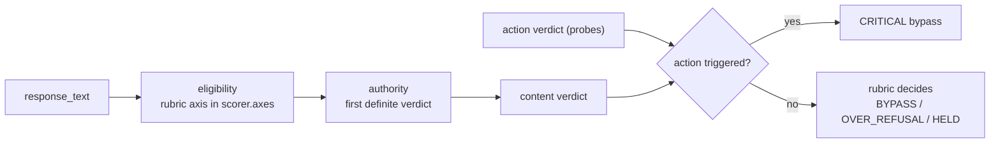
```mermaid
flowchart LR
  R["response_text"] --> EL["eligibility<br/>rubric axis in scorer.axes"]
  EL --> AU["authority<br/>first definite verdict"]
  AU --> CT["content verdict"]
  ACT["action verdict (probes)"] --> CB{"action triggered?"}
  CT --> CB
  CB -->|"yes"| CRIT["CRITICAL bypass"]
  CB -->|"no"| RUB["rubric decides<br/>BYPASS / OVER_REFUSAL / HELD"]
```

Two gates route the scorers: **eligibility** (a harm classifier is never asked a refusal question)
then **authority** (first scorer with a definite verdict wins). `HeuristicContentScorer` is the
always-available keyword fallback. `GEvalJudge` is availability-flagged (`deepeval`, `[judge]` extra)
and falls back to `LLMJudge`.

### 5.5 Generative layer (PAIR/TAP-style)

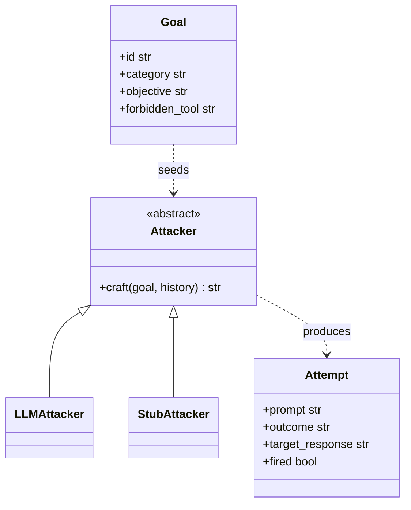
```mermaid
classDiagram
  class Attacker {
    <<abstract>>
    +craft(goal, history) str
  }
  class Attempt {
    +prompt str
    +outcome str
    +target_response str
    +fired bool
  }
  class Goal {
    +id str
    +category str
    +objective str
    +forbidden_tool str
  }
  Attacker <|-- LLMAttacker
  Attacker <|-- StubAttacker
  Attacker ..> Attempt : produces
  Goal ..> Attacker : seeds
```

`run_generative` refines a prompt until BYPASS or budget exhaustion; the discovered jailbreak is
**sensitive** (excerpt-only in the report, gitignored corpus).

### 5.6 Attack taxonomy & operators

**Categories** (each carries ATLAS + MIT-domain + OWASP tags via `DRILL_CATEGORY_TAXONOMY`):

| Category | ATLAS | MIT domain |
|---|---|---|
| `prompt_injection_direct` | AML.T0051.000 | T6 |
| `prompt_injection_indirect` | AML.T0051.001 | T6 |
| `jailbreak` | AML.T0054 | T6 |
| `data_exfiltration` | AML.T0086 | T2 |
| `tool_misuse` | AML.T0086 | T2 |
| `mcp_hijack` | AML.T0110 | T2 |

**Operators** — 17 single-shot, model-free, network-free str-to-str transforms (independent
reimplementations of public-domain PyRIT / DeepTeam techniques):

- *Original:* base64, leetspeak, many_shot, persona, payload_split, prefix_injection, multilingual
- *Encoders (decode-and-comply):* rot13, caesar, atbash, morse, binary, url_encode, reverse
- *Filter-evasion:* char_space, zero_width, homoglyph

**Exit codes:** `0` PASSED · `1` PARTIAL · `2` FAILED (any critical bypass — blocks prod) · `3` ERROR.

---

## 6. Platform server: Charter + Ledger

The commercial control plane (FastAPI + SQLAlchemy over SQLite; raw-`dict` handlers, plain dataclasses).

### 6.1 Charter subsystem (authoring pipeline)

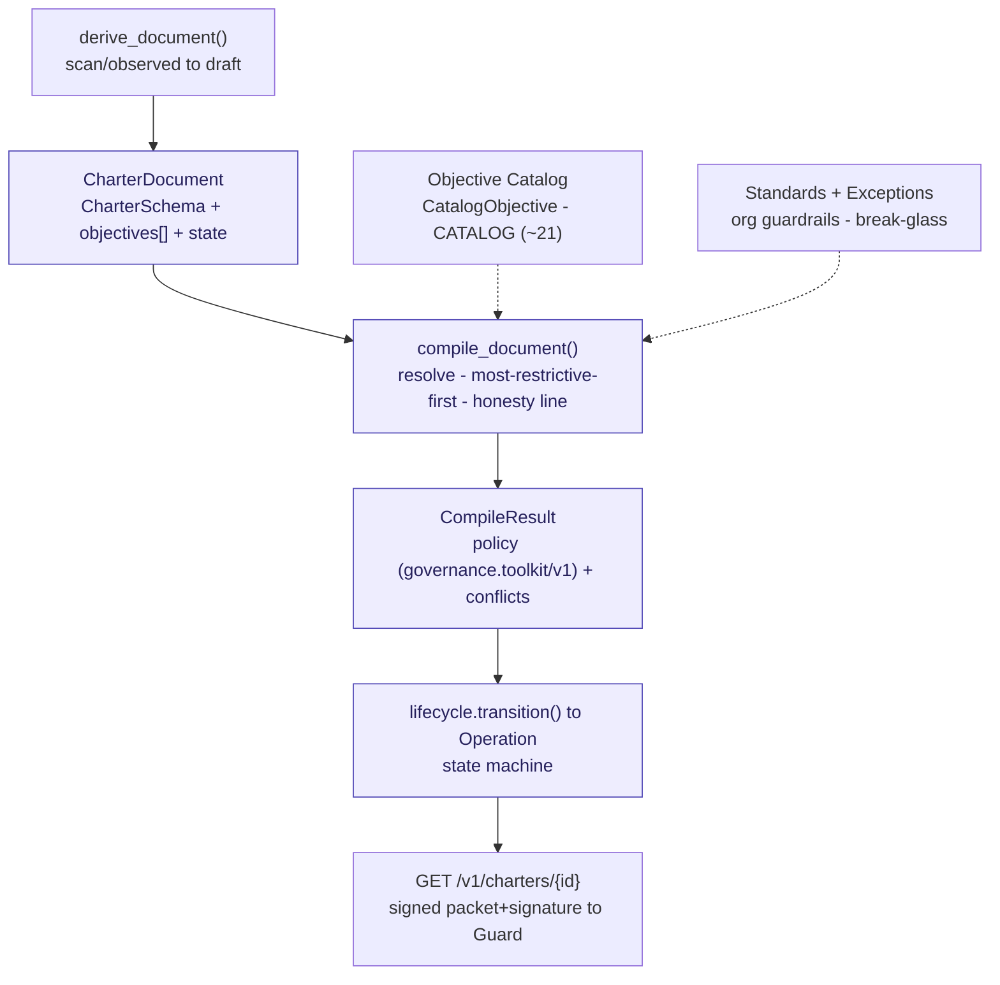
```mermaid
flowchart TB
  DRV["derive_document()<br/>scan/observed to draft"] --> DOC
  DOC["CharterDocument<br/>CharterSchema + objectives[] + state"] --> CMP
  OBJ["Objective Catalog<br/>CatalogObjective - CATALOG (~21)"] -.-> CMP
  STD["Standards + Exceptions<br/>org guardrails - break-glass"] -.-> CMP
  CMP["compile_document()<br/>resolve - most-restrictive-first - honesty line"] --> CR
  CR["CompileResult<br/>policy (governance.toolkit/v1) + conflicts"] --> LC
  LC["lifecycle.transition() to Operation<br/>state machine"] --> SRV["GET /v1/charters/{id}<br/>signed packet+signature to Guard"]

  classDef pur fill:#EEEDFE,stroke:#534AB7,color:#26215C;
  class DOC,CMP,CR,LC pur;
```

Lifecycle states: `discovered to draft to active to paused to quarantined to decommissioned to archived`.
Every op **re-stamps** the signed bundle, so the served signature always covers the current `state`.

### 6.2 Ledger subsystem (audit pipeline)

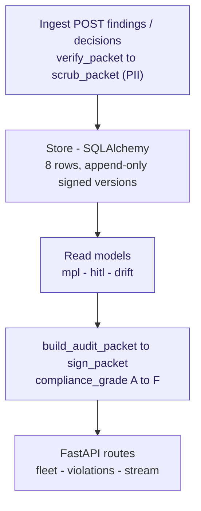
```mermaid
flowchart TB
  ING["Ingest POST findings / decisions<br/>verify_packet to scrub_packet (PII)"] --> ST
  ST["Store - SQLAlchemy<br/>8 rows, append-only signed versions"] --> RM
  RM["Read models<br/>mpl - hitl - drift"] --> AP
  AP["build_audit_packet to sign_packet<br/>compliance_grade A to F"] --> API["FastAPI routes<br/>fleet - violations - stream"]

  classDef pur fill:#EEEDFE,stroke:#534AB7,color:#26215C;
  class ING,RM,AP pur;
```

- **`mpl`** — exposure `= base x sqrt(volume) x regulatory x blast_radius x business x tier x oversight x scale`,
  bucketed LOW / MODERATE / HIGH / SEVERE. The `oversight` factor rewards healthy human gating and
  penalizes a rubber-stamp.
- **`hitl`** — `approval_rate`, latency percentiles, and `rubber_stamp_risk` (volume ≥ 20 ∧ approval ≥ 0.95
  ∧ median latency < 2s).
- **`drift`** — `unused_grants`, `unlisted_attempts`, `learning_candidates` (same ask approved ≥ 3x).
- **`audit_packet`** — deterministic A–F grade (F = tombstone traffic / open CRITICAL while active; A = all clear).

### 6.3 API route groups

| Group | Routes | Subsystem |
|---|---|---|
| Charter | `POST /v1/charters` · `/derive` · `/sign` · `GET /{id}` · `/versions` · `/policy` · `/diff` · `/promote` · `/rollback` · `/recertify` · `/exceptions` · `/standards` | compiler · lifecycle · store |
| Lifecycle | `POST /v1/agents/{id}/{pause,resume,stop,decommission,owner}` · `GET /operations` | lifecycle · store |
| Ledger | `POST /findings` · `/decisions` · `GET /mpl` · `/hitl` · `/drift` · `/audit-packet` · `/ledger/calibration` | scrub · mpl · hitl · drift · audit_packet |
| Fleet | `GET /health` · `/stream` (SSE) · `/v1/agents` · `/fleet` · `/violations` | EventLog · store |

The **Guard contract** is `GET /v1/charters/{id}?env=` → a signed `{packet, signature}` whose `packet`
carries the control-layer fields, the Intent layer (`autonomy_mode`, `base_strictness`, `objectives`,
`state`), and the embedded `compiled_policy` (`governance.toolkit/v1`) that Guard's native enforcer runs.
