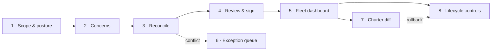

# BlastContain — GUI Wireframes

**Low-fidelity wireframes for the Platform web console**
Version 0.1 — Draft | 2026-05-30 | Audience: Product, Design, Engineering

> These are **low-fi, flow-first** sketches — the goal is to lock *what's on each screen and how the
> flow feels*, not pixels. They version with the spec so they stay honest. Render them, then take the
> make-or-break screen (Screen 1–4, the authoring wizard) into a clickable prototype.
>
> Companion specs: [charter-spec](BlastContain-charter-spec.md) (authoring model §3, catalog §4,
> lifecycle §7), [platform-spec](BlastContain-platform-spec.md) (architecture). **Status: ⬜ all
> screens are proposals — no UI is built yet.**

---

## Approach — two passes, flow before pixels

1. **Low-fi, to lock the flow** (this doc / Excalidraw). The product risk is authoring *friction*,
   not chrome. Nail the sequence and what each screen carries first.
2. **Clickable prototype of the make-or-break screen only** — the authoring wizard (Screens 1–4).
   Since the console will be React/Next, generate it in **v0.dev** so you can *feel* picking concerns
   and reconciling conflicts. That is where adoption is won or lost.

## Two personas (hybrid console)

| Persona | Primary screens | Notes |
|---|---|---|
| **Agent owner / developer** | 1–4 (author), 7 (diff), 8 (lifecycle) | low-friction; can also drive via CLI / PR in-workflow |
| **Central governance group** | 5 (fleet), 6 (exception queue), Standards authoring (= Screen 1 in "Org Standard" scope) | admin-heavy, web-native |

## Screen map



---

## Screen 1 — Authoring wizard · Scope & posture  *(make-or-break)*

Implements charter-spec §3.5.2 (the three axes) — Scope, Autonomy first; strictness/tier secondary.

```
┌─ New Charter ─────────────────────────  ● Scope   ○ Concerns   ○ Reconcile   ○ Sign ─┐
│                                                                                        │
│  SCOPE                                                                                 │
│   ( ) Org Standard   — applies to every agent in the tenant   (governance group only) │
│   (•) Agent Charter  — this agent only                                                 │
│                                                                                        │
│   Agent ID [ invoice-bot            ]   Environment [ prod ▾ ]                          │
│   ⓘ Identity = (agent_id, environment)                                                 │
│   Seed from:  [ ↻ Latest Verify scan ]   [ Archetype template ▾ ]                      │
│                                                                                        │
│  AUTONOMY   (sets how every concern compiles)                                          │
│   ( ) Autonomous — runs unattended;  concerns → DENY                                   │
│   (•) Copilot    — human present;    concerns → REQUIRE APPROVAL                       │
│      ⓘ Copilot adds approval latency only where a human is already in the loop.        │
│                                                                                        │
│  POSTURE (secondary)   Strictness [ Balanced ▾ ]    Trust tier [ 1 ▾ ]                  │
│                                                                                        │
│                                                    [ Cancel ]        [ Next → ]         │
└────────────────────────────────────────────────────────────────────────────────────────┘
```
**Key moves:** scope toggle switches the whole flow into Standard-authoring; "Seed from scan/template"
makes authoring *review-not-blank-form*; autonomy choice visibly states the compile consequence.

---

## Screen 2 — Authoring wizard · Concerns  *(the catalog)*

Implements charter-spec §3.5.3 / §4. Plain-language concerns; inherited mandatory ones locked;
"compiles to" is expandable, not primary.

```
┌─ New Charter · invoice-bot/prod ────────  ○ Scope   ● Concerns   ○ Reconcile   ○ Sign ─┐
│  What do you care about?        search [              ]        Autonomy: Copilot         │
│                                                                                          │
│  ▾ Data integrity & exfiltration                                                         │
│    [✓🔒] Never change production data       inherited · mandatory      → 2 AGT rules  ⌄  │
│    [✓ ] Block all data-exfiltration paths                              → egress+tools ⌄  │
│    [✓ ] No PII/PHI may leave the agent                                 → mask+scrub   ⌃  │
│         └ compiles to: API methods ⊆ read · require_approval (copilot) · proven by      │
│           MEM-01/05 · risk 2.1 · OWASP T2                                                │
│  ▸ Secrets & identity              (2 of 2)                                               │
│  ▸ Tool & MCP control              (3 of 3)                                               │
│  ▸ Code & runtime isolation        (2 of 3)                                               │
│  ▸ Delegation, identity & safety   (4 of 6)                                               │
│                                                                                          │
│  🔒 inherited from Org Standard (cannot weaken)            12 concerns selected           │
│  [ Advanced: raw controls ]                              [ ← Back ]      [ Next → ]       │
└──────────────────────────────────────────────────────────────────────────────────────────┘
```
**Key moves:** plain language is the label, technical detail hides behind ⌄; lock icon shows
inheritance; escape hatch for raw controls is present but de-emphasised.

---

## Screen 3 — Authoring wizard · Reconcile reality

Implements charter-spec §3.5 step 3 + §3.6 (conflict tiers). Scan-derived reality vs declared
concerns; conflicts with mandatory concerns route to the Exception flow.

```
┌─ New Charter · invoice-bot/prod ────────  ○ Scope   ○ Concerns   ● Reconcile   ○ Sign ─┐
│  We scanned the agent — reality vs your concerns.            (Verify · 2 min ago)        │
│                                                                                          │
│  ⛔ CONFLICT — violates a mandatory concern                                               │
│     Observed:  tool calls  DELETE /orders                                                 │
│     Concern :  "Never change production data"   inherited · mandatory                     │
│     →  [ Remove the tool ]   [ Request Exception ]                                         │
│        ⓘ mandatory → needs central sign-off (separation of duties)                        │
│                                                                                          │
│  ➕ SUGGESTION — observed, not yet allowed                                                 │
│     Observed:  MCP tool  query_ledger_db        [ Add to allowlist ]  [ Dismiss ]         │
│                                                                                          │
│  ✓ 18 observed capabilities already covered by your concerns.                            │
│                                                                                          │
│                                              [ ← Back ]   [ Next → ]   (1 conflict open)  │
└──────────────────────────────────────────────────────────────────────────────────────────┘
```
**Key moves:** the conflict, not the allowlist, is what's surfaced; a mandatory conflict cannot be
silently waved through — it forces Remove or Exception.

---

## Screen 4 — Authoring wizard · Review & sign

Implements charter-spec §3.5 steps 4–5 + §6 (compiled AGT policy). Intent ↔ compiled side by side;
signing is the commitment gate.

```
┌─ New Charter · invoice-bot/prod ────────  ○ Scope   ○ Concerns   ○ Reconcile   ● Sign ─┐
│  Review the compiled policy, then sign.                         Mode:  audit → strict     │
│                                                                                          │
│  Intent (what you said)         │  Compiled AGT policy (governance.toolkit/v1)            │
│ ────────────────────────────────┼──────────────────────────────────────────────────────  │
│  • Never change production data │  default_action: deny                                  │
│  • Block exfiltration           │  rules:                                                │
│  • No PII leaves                 │   - name: allow-approved-tools                         │
│  • Only approved tools          │     condition: tool_name in [query_db, send_invoice]    │
│  • … 12 concerns                │     action: allow                                      │
│                                  │   - name: block-destructive                            │
│  Trust tier: 1                   │     condition: action.type in [delete, drop]           │
│  did:mesh:z6Mk…                  │     action: require_approval                           │
│  1 Exception pending ⏳         │     approvers: [finance-sec]                            │
│                                  │   …                                                    │
│  ☐ I attest this Charter is correct and complete.                                        │
│                                          [ Save draft ]     [ ✎ Sign & register ]         │
└──────────────────────────────────────────────────────────────────────────────────────────┘
```
**Key moves:** the human sees their *intent* beside the *machine policy*; the attest checkbox + Sign
is a deliberate gate (not a save button); a pending Exception blocks final registration.

---

## Screen 5 — Fleet dashboard

Implements Ledger `/fleet`, `/violations`, `/stream` (platform-spec §4.3). Governance group's home.

```
┌─ Fleet ───────────────────────────────────────────────────  [ Owner ▾ ]  [ Search ] ─┐
│  Agents 142   ● Active 121   ⏸ Paused 6   ⚠ Quarantined 3   ⌫ Decommissioned 12         │
│  Total MPL exposure  $4.82M ▲          Open  CRITICAL 3   HIGH 17                         │
│                                                                                          │
│  Agent           Env   State          Tier  Last scan  Crit  MPL       Owner            │
│ ─────────────────────────────────────────────────────────────────────────────────────── │
│  invoice-bot     prod  ● Active        1     2m         0     $12k      fin-team         │
│  data-syncer     prod  ⚠ Quarantined   2     1h         2     $480k ▲   data-eng    [→]  │
│  support-copilot prod  ● Active        1     5m         0     $30k      cx-team          │
│  shadow-x:8080   -     ◌ Discovered    ?     —          —     —         (unknown)   [→]  │
│                                                                                          │
│  [ Violations ]   [ Live stream ]   [ Export Audit Packet ]                              │
└──────────────────────────────────────────────────────────────────────────────────────────┘
```
**Key moves:** lifecycle state + priced MPL on every agent; discovered shadow agents surface here
un-owned; one click to drill into a quarantined agent.

---

## Screen 6 — Exception approval queue

Implements charter-spec §3.6 (break-glass, central sign-off, expiry, separation of duties).

```
┌─ Exceptions · approval queue ─────────────────────────────  Role: Central Governance ─┐
│  3 pending · you cannot approve your own (separation of duties)                          │
│                                                                                          │
│  Agent        Concern (mandatory)           Justification        Requested  Expires      │
│ ─────────────────────────────────────────────────────────────────────────────────────── │
│  data-syncer  Never change production data  "migration needs     j.lee      90d    [▾]  │
│               DELETE on staging"                                                          │
│    Scope: DELETE /orders (staging only)     MPL if abused: $480k                          │
│    [ Approve + set expiry ▾ ]   [ Deny ]   [ Request more info ]                          │
│ ─────────────────────────────────────────────────────────────────────────────────────── │
│  report-gen   No PII/PHI may leave          "vendor export,      m.ng       30d    [▾]  │
│               DPA signed"                                                                 │
└──────────────────────────────────────────────────────────────────────────────────────────┘
```
**Key moves:** every exception shows scope + MPL-if-abused so the approver prices the risk; expiry is
mandatory; the requester can't be the approver.

---

## Screen 7 — Charter diff / version  *(capability creep)*

Implements charter-spec §3 (intent-level diff) + §7.3 (rollback). Flags escalation, not just change.

```
┌─ invoice-bot/prod · versions ────────────────────────────────────────────────────────┐
│  Compare  [ v1.3.0 ▾ ]  →  [ v1.4.0 ▾ ]        signed did:mesh:z6Mk… · 2026-05-28        │
│                                                                                          │
│  CONCERNS                                                                                 │
│   + Block all data-exfiltration paths           added                                    │
│   - No prod agent on developer workstation       removed   ⚠ capability creep             │
│                                                                                          │
│  CONTROLS                                                                                 │
│   permitted_tools   + refund_invoice    ⚠ new destructive-capable tool                    │
│   egress_blocked    true → false        ⚠ loosened                                        │
│   trust_tier        1 → 2               ⚠ escalation                                      │
│                                                                                          │
│   ⚠ 3 changes increase the capability surface.    [ View AGT policy diff ]   [ Rollback ] │
└──────────────────────────────────────────────────────────────────────────────────────────┘
```
**Key moves:** diff is at the *intent* level (concerns) first, controls second; escalations are
flagged in red; rollback is one click (reverts to last-known-good, §7.3).

---

## Screen 8 — Lifecycle controls  *(pause / decommission with impact notice)*

Implements charter-spec §7.1 (operations) + §7.5/§7.6. Every action surfaces its impact first.

```
┌─ invoice-bot/prod · lifecycle ───────────────────────────────  State: ● Active ──────┐
│  [ ⏸ Pause ]  [ ↻ Rollback ]  [ 🌓 Shadow run ]  [ ⏹ Emergency stop ]  [ ⌫ Decommission ]│
│                                                                                          │
│  ── Pause invoice-bot/prod ? ─────────────────────────────────────────────             │
│   Mode:  (•) deny-all    ( ) drain    ( ) halt                                            │
│   Impact:                                                                                 │
│     • all tool calls denied at AGT; process stays alive (reversible)                      │
│     • 2 agents delegate to this one → they will receive denials                          │
│     • in-flight requests: rejected (deny-all mode)                                        │
│   Reason [ maintenance window 22:00–23:00          ]                                      │
│                                            [ Cancel ]      [ Confirm pause ]              │
└──────────────────────────────────────────────────────────────────────────────────────────┘
```
**Key moves:** pause mode is a choice (deny-all / drain / halt) and the **impact notice** spells out
the consequence — including delegation dependents (§2.4 / §7.6) — *before* you confirm. Decommission
uses the same pattern with a stronger, irreversible warning + final Audit Packet.

---

## Conventions & notes

- **Plain language is the label; technical detail is one expand away** (⌄). The human-facing copy is
  parked for a dedicated relabel pass (charter-spec §9 "deferred").
- **Every destructive/lifecycle action shows an impact notice before confirm.**
- **Mandatory/inherited items are visibly locked** (🔒) and route conflicts to the Exception flow.
- **The in-workflow path** (CLI / PR check) mirrors Screens 1–4 for developers who author from the
  repo; the console is the rich surface, not the only one.

## Open questions / next

1. Take **Screens 1–4** into v0.dev as a clickable React prototype (the make-or-break flow).
2. Decide the **CLI/PR equivalent** of the wizard for in-workflow authoring.
3. Wireframe a **Standards authoring** screen for the governance group (Screen 1 in "Org Standard"
   scope, with enforcement-level `mandatory/recommended/optional` per concern).
4. Wireframe a **Plugins** management screen (registry: attack sources, guardrail models, enforcement
   backends, checks — enable / version / configure / provenance). AI-Infra-Guard as the reference.
4. Confirm copy/iconography in a later high-fi pass (Figma).
