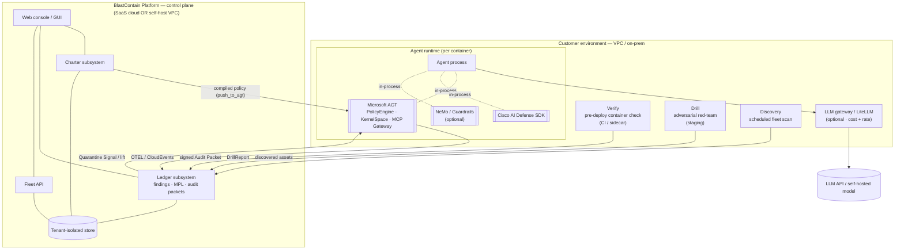
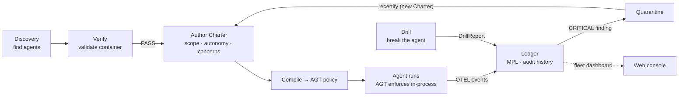
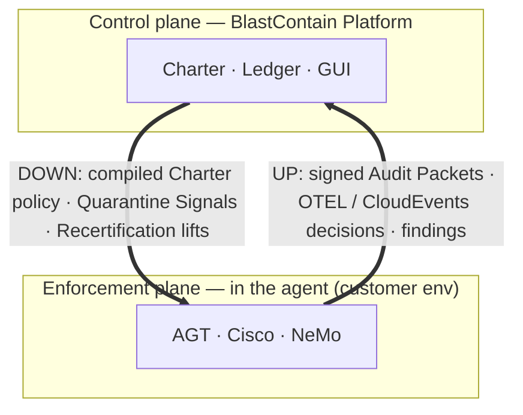

# BlastContain — Platform Specification

**Agent Governance Platform — umbrella overview & architecture**
Version 1.0 — Draft | 2026-05-30 | Audience: Engineering, Security, DevOps, Compliance, Product

> This is the **umbrella spec**: what BlastContain is, how the pieces fit, where they run, and how
> data flows. Deep engineering detail lives in the component specs — this document points to them
> rather than duplicating:
> - **Charter** → [BlastContain-charter-spec.md](BlastContain-charter-spec.md)
> - **Verify** → [BlastContain-verify-spec.md](BlastContain-verify-spec.md)
> - Ledger / Drill / Discovery — summarised here; detailed specs to follow.

> **Status legend:** ✅ implemented · 🟡 partial · ⬜ planned

---

## Contents

1. [What BlastContain Is](#1-what-blastcontain-is)
2. [The Sovereign Stack](#2-the-sovereign-stack)
3. [Architecture](#3-architecture)
4. [The Six Components](#4-the-six-components)
5. [Deployment Models](#5-deployment-models)
6. [Regulatory & Taxonomies](#6-regulatory--taxonomies)
7. [Release Strategy](#7-release-strategy)
8. [Spec Index](#8-spec-index)

---

## 1. What BlastContain Is

BlastContain is a one-stop governance platform for agent deployments. Every other security tool in
the stack watches one layer; BlastContain governs the **whole agent lifecycle** — discovery,
pre-deployment validation, policy authoring & enforcement, continuous priced audit, and adversarial
testing.

**Six components, one platform:**

| Component | What it does | Runs | Detailed spec |
|---|---|---|---|
| **Verify** | Validates the agent **container/environment before it is used** — 27 infra checks, signed Audit Packet | pre-deployment (CI / sidecar) | [verify-spec](BlastContain-verify-spec.md) |
| **Charter** | Agent policy constitution — turns human intent into machine-enforceable policy, compiled to AGT | platform (control plane) | [charter-spec](BlastContain-charter-spec.md) |
| **Ledger** | Continuous audit trail — stores findings, prices each (MPL), fleet dashboard | platform (control plane) | §4.3 |
| **Drill** | Adversarial red-team — **tries to break the agent**, produces a signed DrillReport | scheduled / pre-release | §4.4 |
| **Discovery** | Shadow-AI enumeration — **searches for agents** not yet registered | scheduled | §4.5 |
| **Guard** | In-process enforcer — loads a local YAML or compiled Charter, resolves **allow/ask/deny** at the tool-call boundary | in-process (enforcement plane) | [guard-spec](BlastContain-guard-spec.md) |

**The two planes.** BlastContain is the **control plane** (author intent, govern, audit). It does
**not** make runtime decisions itself — that is the **enforcement plane**: **Guard**
(`blastcontain-guard`), the default in-process enforcer at the tool-call boundary, with Microsoft
AGT as a peer engine for the same `governance.toolkit/v1` policy (guard-spec §8). BlastContain
compiles Charters to that policy and ingests enforcement decisions back into the Ledger (§3).

**The integration guarantee.** No agent registers without passing Verify. No agent is registered
without a Charter. Every runtime event flows to the Ledger over OTEL. Every Drill report attaches to
the Audit Packet. Every Discovery finding triggers a Verify run for the newly found agent.

**The governing question.** Is every agent known, policy-bound, continuously monitored, financially
priced, and adversarially tested — and can you prove it to a regulator?

---

## 2. The Sovereign Stack

AGT and Cisco run in-process inside each agent; NeMo and an LLM gateway are optional; BlastContain
runs above them all as the control plane.

| Layer | Component | Role | In scope |
|---|---|---|---|
| **Foundation** | Cisco AI Defense | Network defence, MCP/prompt inspection, **data classification → MPL base values** | core |
| **Framework** | Microsoft AGT | Policy engine (`governance.toolkit/v1`), Ed25519 `did:mesh:` identity, KernelSpace, MCP Security Gateway — **the enforcement plane** | core |
| **Skin** | NeMo / Guardrails AI | Content safety, PII masking, jailbreak detection, schema validation | optional / pluggable |
| **Gateway** | LiteLLM-class proxy | Cost / token budgets / rate limits (OWASP T4) | optional / pluggable |
| **Platform** | **BlastContain** | Charter authoring, Verify, Ledger (MPL), Drill, Discovery — **the control plane** | — |

> AGT is the only layer that receives compiled Charter policy. Cisco, NeMo, and the gateway are
> signal sources / specialised enforcers, not policy targets. AGT is **Public Preview** (v3.7, May
> 2026); see [charter-spec §6](BlastContain-charter-spec.md) for the verified policy contract.

---

## 3. Architecture

### 3.1 What is where (components & deployment)



- **Customer environment** holds the agents (each with AGT + Cisco in-process, NeMo optional), the
  three OSS tools (Verify pre-deploy, Drill in staging, Discovery on a schedule), and an optional LLM
  gateway in the model call path.
- **BlastContain Platform** (control plane) holds Charter, Ledger, the Fleet API, the web console,
  and a tenant-isolated datastore. It runs **either** SaaS (BlastContain-hosted) **or** self-host
  inside the customer boundary (§5).

### 3.2 The governance loop (data flow)



Discovery finds what exists → Verify validates the environment → Charter declares intent and compiles
to AGT → the agent runs under enforcement, streaming decisions to the Ledger over OTEL → the Ledger
prices and records everything → a CRITICAL finding quarantines the agent until a remediating Charter
is recertified → Drill periodically proves the controls still hold.

### 3.3 Trust boundary (what crosses, which way)



The boundary between the agent environment and the Platform carries exactly two directions:
**down** = compiled policy + lifecycle signals to AGT; **up** = signed Audit Packets + OTEL decision
events + tool findings into the Ledger. Identity is Ed25519 `did:mesh:` throughout.

---

## 4. The Six Components

### 4.1 Verify — validate the agent container *before use* ✅

A CLI scanner (`blastcontain-verify`) that runs **inside the agent's environment before it is allowed
to register**. Probes 27 infrastructure dimensions (kernel isolation, egress, secrets, privilege,
PII, MCP/tools, code patterns, supply chain, TLS…), augmented by Cisco/AGT/Presidio when present.
Produces a cryptographically signed Audit Packet (APPROVED / REJECTED / QUARANTINED) and posts to the
Ledger. **If the environment is unsafe, the agent does not get in.** → Full detail in
[verify-spec](BlastContain-verify-spec.md).

### 4.2 Charter — the policy constitution 🟡

Turns **human intent into machine-enforceable policy**: the human declares plain-language *concerns*
(scope → autonomy → concerns), the compiler emits AGT `governance.toolkit/v1` policy. Carries the
agent's allowlists, trust tier, delegation rules, HITL config, and lifecycle. Governs the full agent
state machine (register → pause / quarantine → decommission). → Full detail in
[charter-spec](BlastContain-charter-spec.md) — the deepest of the component specs.

### 4.3 Ledger — continuous priced audit trail ✅ (core built)

The memory of the platform. Ingests signed Audit Packets (Verify/Drill/Discovery) and Guard/AGT
runtime decisions (CloudEvents), **scrubs PII/secrets before persistence** (hashing — correlatable,
not readable; Presidio used-if-present, `ledger/scrub.py` ✅), and prices risk via the
seven-component formula `(Base × Volume) × Regulatory × Trust-Aware Blast Radius × Business
Context × TrustTier × Human-Oversight` ([`ledger/mpl.py`](../server/blastcontain/ledger/mpl.py) ✅
— per-org calibration via `/v1/ledger/calibration`, banded **exposure index** presentation). Measures
**HITL quality** (`ledger/hitl.py` ✅ — approval latency, override rate, rubber-stamp detection) and
**Charter drift** (`ledger/drift.py` ✅ — unused grants → right-sizing, unlisted attempts, repeated
approvals → learning candidates, scan contradictions). Generates the signed **Audit Packet**
(`ledger/audit_packet.py` ✅ — deterministic compliance grade A–F with rationale; a final packet on
decommission) and serves the fleet dashboard (`/fleet`, `/violations`, `/stream` SSE — all ✅).
Open: MPL re-basing on real breach-cost data (calibration is the mechanism), LLM-judge approval
sampling, delegation-chain blast radius. *Detailed Ledger spec: to follow.*

### 4.4 Drill — *try to break the agent* ✅

Adversarial red-team. Runs attack scenarios (prompt injection, trust-boundary probes, delegation
abuse, MCP hijack, data exfiltration, jailbreak) against a registered agent in staging, measures
detection latency, and produces a single signed **DrillReport** in the same Audit Packet format —
proving the governance controls work *before* a real incident. CRITICAL drill findings block prod
promotion. Built on Apache-2.0 OSS (AI-Infra-Guard, DeepEval, Qwen3Guard) with a versioned
three-layer attack corpus and action-level cage ground truth → [drill-spec](BlastContain-drill-spec.md).

### 4.5 Discovery — *search for agents* ⬜

Shadow-AI enumeration. Runs on a schedule; scans network, processes, and git repos for agents and
models **not registered** in the Ledger; cross-references the registry (registered / known-unverified
/ unknown); triggers Verify and bootstraps a draft Charter for each newly found agent. You cannot
govern agents you do not know exist. *Detailed Discovery spec: to follow.* (Not to be confused with
**Scout**, `blastcontain-oss/tools/scout` — the arXiv corpus scout that feeds the Drill corpus.)

### 4.6 Guard — *the runtime locks* 🟡

The in-process enforcer (`blastcontain-guard`, Apache-2.0) a team embeds in its copilot. Loads a
local `governance.toolkit/v1` YAML (open, standalone) *or* a signed Platform Charter, intercepts
tool calls at the framework boundary, resolves **allow / ask / deny**, prompts the user on *ask*,
and streams every decision as a signed decision log to the Ledger. OSS wedge built
(`blastcontain-oss/guard`). → Full detail in [guard-spec](BlastContain-guard-spec.md).

---

## 5. Deployment Models

The Platform ships in two forms; the data model is **tenant-isolated from day one** to serve both.

| Model | Where it runs | Notes |
|---|---|---|
| **SaaS multi-tenant** | BlastContain-hosted cloud | customers are tenants; web console hosted by us |
| **Self-host enterprise** | inside the customer boundary | single tenant per deployment; agents never leave the boundary |

In both, the OSS tools and the agents (with AGT/Cisco in-process) run in the **customer environment**;
only the control-plane signals cross the boundary (§3.3).

---

## 6. Regulatory & Taxonomies

- **EU AI Act** — Audit Packets satisfy Art. 12 (technical documentation + logging), Art. 14
  (human oversight, incident response via Recertification, HITL evidence), and Art. 50 (transparency
  labels, carried on the Charter). Drill DrillReports satisfy ongoing control verification.
- **MIT AI Risk Repository** — every finding/concern mapped to a real subdomain (validated vs
  [airisk.mit.edu](https://airisk.mit.edu/), Dec 2025; 7 domains / 24 subdomains).
- **OWASP Agentic (ASI)** — concerns mapped to T1–T15 (validated vs OWASP ASI "Agentic AI – Threats
  and Mitigations" v1.0). See [charter-spec §4](BlastContain-charter-spec.md) for the full mapping;
  AGT independently claims OWASP Agentic Top 10 coverage.

> Legacy `MIT-SYS-02 / NET-05 / TOOL-04 / DATA-11`-style IDs in older docs are **not** real MIT IDs —
> purge on contact.

---

## 7. Release Strategy

Each component ships independently; the platform is proven piece by piece.

> **Note:** the phase list below is the original *proving sequence*, not current status — Verify and
> Drill are already built (Drill is ✅, not a final phase). The maintained, up-to-date sequence is
> [BlastContain-roadmap.md](BlastContain-roadmap.md).

```
Phase 1  Verify          Harden, publish to PyPI
Phase 2  Charter + GUI   Intent-based authoring; compile to AGT
Phase 3  Verify ↔ Charter Scan against the registered policy
Phase 4  Ledger          Priced audit trail, fleet dashboard
Phase 5  AGT enforcement push_to_agt — deny decisions block execution
Phase 6  Discovery       Find unknown agents, trigger Verify
Phase 7  Drill           Prove controls adversarially
```

---

## 8. Spec Index

| Spec | Covers | Status |
|---|---|---|
| [BlastContain-design-tenets.md](BlastContain-design-tenets.md) | the principles BlastContain is built on — Tenet 1: governance is a byproduct, not a prerequisite | 🟡 |
| [BlastContain-charter-spec.md](BlastContain-charter-spec.md) | Charter — authoring model, catalog, schema, AGT compilation, lifecycle | 🟡 review-ready |
| [BlastContain-verify-spec.md](BlastContain-verify-spec.md) | Verify — checks, augmentation, report format | ✅ |
| *Ledger spec* | MPL, blast radius, audit packet, ingestion | ⬜ to follow |
| [BlastContain-drill-spec.md](BlastContain-drill-spec.md) | Drill — attack corpus (replay/operators/generative), action-vs-content scoring, ATLAS, plugin framework | 🟡 |
| *Discovery spec* | scanners, bootstrap | ⬜ to follow |
| [BlastContain-guard-spec.md](BlastContain-guard-spec.md) | `blastcontain-guard` — the in-process enforcement library (P4 core) | 🟡 OSS wedge built |
| [BlastContain-data-trust-spec.md](BlastContain-data-trust-spec.md) | data-trust / Content Control Plane — progressive tiers + pluggable guardrail models (Qwen3Guard) | ◇ seed |
| [BlastContain-plugin-spec.md](BlastContain-plugin-spec.md) | cross-cutting plugin registry + management UI (Tenet 6) | ⬜ |
| [BlastContain-roadmap.md](BlastContain-roadmap.md) | product roadmap — Part One (govern over agents) → Part Two (govern by construction) | 🟡 |
| [BlastContain-zero-trust-alignment.md](BlastContain-zero-trust-alignment.md) | maps BlastContain to Anthropic's Zero Trust for AI Agents; tier model + gap roadmap | 🟡 |
| [BlastContain-gui-wireframes.md](BlastContain-gui-wireframes.md) | low-fi console wireframes (8 screens) | 🟡 |
| This document | platform overview, Sovereign Stack, architecture, deployment | 🟡 |

*BlastContain — governance that contains the blast radius.*
