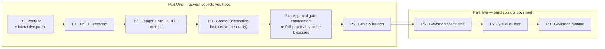

# BlastContain — Roadmap & Work Breakdown

**Scope: interactive / copilot / side-of-desk agents.** Human-supervised assistants that augment a
person's work. **The human-in-the-loop is a first-class control.** Autonomous / unattended agents are
explicitly **out of scope for v1** (the architecture doesn't preclude them later).
Version 0.2 — Draft | 2026-05-31 | Audience: Product, Engineering

> Two arcs: **Part One** governs the copilots you already have; **Part Two** is the environment to
> *build* governed copilots. Work items are `- [ ]` epics, not tickets.
> **Status:** ✅ done · 🟡 in progress · ⬜ planned

---

## What the interactive/side-of-desk scope changes

| Decision | Effect on the build |
|---|---|
| Default autonomy = **interactive/copilot** | concerns compile to **`require_approval`**, not `deny`; HITL is core |
| Human is present | approval gates add ~zero latency → the earlier HITL objection is moot |
| Copilots run **on workstations** | workstation execution is *expected*, not a CRITICAL finding — Verify needs an interactive profile |
| Mostly **single-user / single-agent** | delegation chains & multi-agent control-consistency **de-prioritised** to Part Two |
| Copilots live in IDEs / browsers / SaaS | Discovery targets **assistants**, not just network-deployed server agents |
| Smaller blast radius, human oversight | MPL weights data sensitivity + an **oversight factor**; less delegation-chain amplification |

**Explicitly de-prioritised for v1:** autonomous hard-deny path · multi-agent delegation graphs ·
network-range Discovery · fleet-autonomy drills · hardware-bound identity.

---

## Part One — govern the copilots you have

### P0 · Verify ✅ done — + interactive profile

- [x] 27 container checks, signed Audit Packet, local + server mode
- [ ] **Interactive/workstation profile** — `LOCAL-01` / `DISK-01` become *informational* (workstation
      execution is normal for side-of-desk); tune check severities for the copilot runtime
- [ ] "Approved-tool" awareness hook so Verify can read a Charter's `permitted_tools` (Phase-3 tie-in)

### P1 · Drill ✅ built + Discovery ⬜

> **Drill status is tracked in [drill-spec](BlastContain-drill-spec.md)** — ✅ built 2026-06
> (build-order 1–7: cage + action probes + three-layer corpus + two-plane scoring + signed
> DrillReport + hardened container + guards; plus JailbreakBench/over-refusal, WildGuard, model
> sweep). Still open from the list below: AIG live field-mapping, the plugin registry (+ UI), and
> the Ledger-baseline tie-in. **Discovery is unstarted** — note that Scout
> (`blastcontain-oss/tools/scout`, the arXiv corpus scout feeding the Drill corpus) is *not*
> Discovery.

**Drill — adversarial red-team, scoped to the side-of-desk threat model**
- [ ] Scenario runner + signed **DrillReport** (same Audit-Packet format as Verify)
- [ ] **Prompt injection** — direct *and* indirect (poisoned web pages / documents the copilot reads)
- [ ] **Data exfiltration** — copilot manipulated into sending data outbound
- [ ] **Jailbreak / content-policy evasion**
- [ ] **Tool misuse** — an approved tool driven to a harmful end
- [ ] Detection-latency measurement; before/after baseline vs the Ledger
- [ ] CLI + local mode; CI pre-release gate
- [ ] **Built on** AI-Infra-Guard (attacks + MCP/skill scan) · DeepEval (judge + agent metrics) · Qwen3Guard — local, Apache 2.0 ([drill-spec](BlastContain-drill-spec.md))
- [ ] **Three-layer corpus** — Replay (HF / CVE datasets) → Operators (arXiv techniques) → Generative (Heretic attacker loop); version-pinned
- [ ] **Action ground-truth** in the cage (canary / forbidden-tool / egress) — Drill's value-add over content scoring
- [ ] **MITRE ATLAS** mapping on findings; scheduled corpus freshness pull
- [ ] **Plugin registry + UI** — Drill is the first consumer; cross-cutting (Tenet 6)
- [ ] *Defer:* delegation-abuse / multi-agent scenarios (Part Two)

**Discovery — find the assistants, not just servers**
- [ ] Host/process scan for **copilot signatures** (IDE extensions, desktop assistants, CLI agents)
- [ ] **Browser-extension / SaaS-connector inventory** (where side-of-desk copilots actually live)
- [ ] Git / repo scan for agent configs + MCP servers
- [ ] Registry cross-reference → registered / known-unverified / shadow
- [ ] **Draft-Charter bootstrap** from observed copilot capability
- [ ] Trigger-Verify on each new find; signed Discovery report
- [ ] *Secondary:* network-range scanning (less relevant for desktop copilots)

### P2 · Ledger + MPL ✅ core built (Alembic, LLM-judge sampling, blast-radius graph open)

- [x] **Persistence** — SQLAlchemy (SQLite default, `BLASTCONTAIN_DB_URL`); Alembic migrations open
- [x] Ingest endpoint hardening (bearer auth) + **signature verification** on inbound packets
- [x] Fleet dashboard — `/fleet`, `/violations`, `/stream` (SSE)
- [x] **★ MPL credibility** — per-org calibration (`/v1/ledger/calibration`); **human-oversight
      factor** wired to observed HITL quality (healthy gate 0.6× · rubber-stamped 0.9× · none 1.0×);
      presented as a banded *exposure index* with a methodology note; base values stay indicative —
      re-basing on real breach-cost data remains a calibration exercise per org
- [x] **★ HITL quality metrics** — approval latency (median/p95), override/approval rates,
      allow-always pressure, rubber-stamp detection (`/v1/agents/{id}/hitl`); post-hoc LLM-judge
      sampling still open
- [x] Pattern detection + Charter drift tracker — unused grants (→ right-sizing), unlisted attempts,
      repeated approvals → learning candidates, scan-vs-constraint contradictions
      (`/v1/agents/{id}/drift`)
- [x] Evidence scrubbing (hash PII/secrets before persist; Presidio used-if-present)
- [x] **Audit Packet generator** — deterministic compliance grade (A–F + rationale), MPL summary,
      finding + approval history; signed; **final packet emitted on decommission**
      (`/v1/agents/{id}/audit-packet`)

### P3 · Charter — interactive-first control plane 🟡 (server-side built; GUI + dev path open)

- [x] Schema — add **Intent layer**: `autonomy_mode` (**default `interactive`**), `base_strictness`,
      `objectives` (`server/blastcontain/charter/schema.py` — `CharterDocument`)
- [x] **Objective catalog** encoded, interactive-weighted: no-PII-out, no-secrets, tool allowlist,
      content-safety, prompt-injection resistance, no-dangerous-code (`charter/catalog.py`)
- [x] **Compiler** — objectives → controls → policy; interactive ⇒ `require_approval` by default;
      emits `governance.toolkit/v1`, cross-validated against the OSS Guard evaluator
- [x] **Standards + inheritance** (mandatory/recommended/optional) + **Exceptions** (break-glass,
      expiring, separation-of-duties checked)
- [x] **★ Derive-then-ratify** — auto-draft a tight Charter from the Verify/Discovery scan
      (`POST /v1/charters/{id}/derive`); the **one-click ratify** GUI is open
- [x] Lifecycle states (register / pause / decommission) — state machine + signed operations log;
      the interactive/workstation Verify profile is still open (P0)
- [ ] **★ Developer authoring path** — CLI + PR check, so compliance is the easy path for devs
- [ ] *Defer:* `permitted_delegates` + multi-agent control-consistency (Part Two)

### P4 · Enforcement = the approval gate 🟡 **★ credibility gate**

> **Guard status is tracked in [guard-spec §13](BlastContain-guard-spec.md)** — the OSS wedge is
> built (`blastcontain-oss/guard`): evaluator, local-YAML + signed-Charter sources, `on_ask`
> pipeline (library level), MCP/Claude-Code/decorator adapters, AGT export/push, signed decision
> log. Still open: conformance harness, versioned decision-event schema → Ledger, approval
> surfaces/console, Drill Role B.

> For interactive copilots the control is **"high-risk actions require a human approval, and the
> decision is recorded — and that can't be bypassed."** Not autonomous deny.

- [ ] `push_to_agt()` — compile + push the policy to the enforcement engine
- [ ] **★ Pluggable backend abstraction** (AGT primary; OPA / Cedar / generic gateway) — the Microsoft hedge
- [ ] **★ HITL approval pipeline** — `require_approval` gate → approver routing → decision capture →
      audit. *This is the core build of the phase.*
- [ ] **Approval surfaces** — render the gate in the copilot's own surface (IDE / chat) **and** the
      console; clear action description; logged decision (Art. 14 evidence)
- [x] Quarantine → recertify loop — auto-quarantine on prod CRITICALs; recertification requires a
      proof addressing the triggering FindingType; paused/quarantined states enforce deny-all at the
      Guard edge
- [ ] **★ Drill Role B** — prove a high-risk action **cannot execute without the approval gate firing**
      (closed-loop proof; this is the demo)
- [x] OTEL / CloudEvents decision ingestion → Ledger (`POST /v1/agents/{id}/decisions`, persisted;
      Guard's LedgerSink round-trips; tombstone traffic raises a finding)

### P5 · Scale & harden ⬜

- [ ] **De-noise + AI triage** — MPL-ranked, deduped findings; model drafts a disposition first
- [ ] **HITL fatigue monitoring** (OWASP T10) + approval-quality alerts
- [ ] **Continuous right-sizing** — "tool unused 90 days → drop?" suggestions from Ledger observation
- [ ] Multi-tenant + self-host hardening; audit-packet bulletproofing (signed, clause-mapped)
- [ ] MITRE ATT&CK mapping; **tier alignment** to Foundation / Enterprise / Advanced
- [ ] Reconcile static `trust_tier` with AGT's dynamic 0–1000 score

---

## Part Two — build governed copilots (govern by construction)

> The moat: the place copilots are *born governed*. Lighter / further out; gated on Part-One design
> partners. **Build P3's Charter authoring as an embeddable component** so it can live inside P7.

- **P6 · Governed scaffolding** ⬜ — build a copilot from a governed template; Charter authored *as you
  compose* (tools, prompts, approval policy); Verify runs inline.
- **P7 · Visual build GUI** ⬜ — pick tools / MCP / model; the **Charter compiles live**; you can't ship
  a copilot that fails its own Charter.
- **P8 · Governed runtime + component catalog** ⬜ — deploy with the approval gate baked in; a catalog
  of pre-Chartered tools/skills.

---

## The shape of it

## The Microsoft hedge

- **Pluggable enforcement backend** (P4) → AGT is *a* target, not *the* product.
- **Compete where a runtime vendor won't:** liability pricing (MPL), the **approval/HITL experience**,
  the cross-vendor Audit Packet, and the **build environment** (Part Two).
- **Own where copilots are built.** Displacing a governance layer is easy; displacing the builder is not.

## Cross-cutting (parallel)

| Workstream | Lands in |
|---|---|
| MPL credibility + oversight factor | P2 |
| HITL approval experience | P4 (core) |
| Developer in-workflow authoring | P3 → Part Two |
| De-noise / AI triage | P5 |
| Audit Packet as regulatory artifact | P2 → |
| Enforcement-backend abstraction (hedge) | P4 |
| Behavioural baseline from test → Semantic Circuit Breaker | P1 capture · P5 detect |
| Data-trust axis — Content Control Plane (progressive tiers, guardrail-model plugins e.g. Qwen3Guard) | ◇ future add-in |

---

## See also
- [BlastContain-charter-spec.md](BlastContain-charter-spec.md) — P3 / P4 detail
- [BlastContain-zero-trust-alignment.md](BlastContain-zero-trust-alignment.md) — gap/horizon backlog into P5+
- [BlastContain-platform-spec.md](BlastContain-platform-spec.md) — architecture
