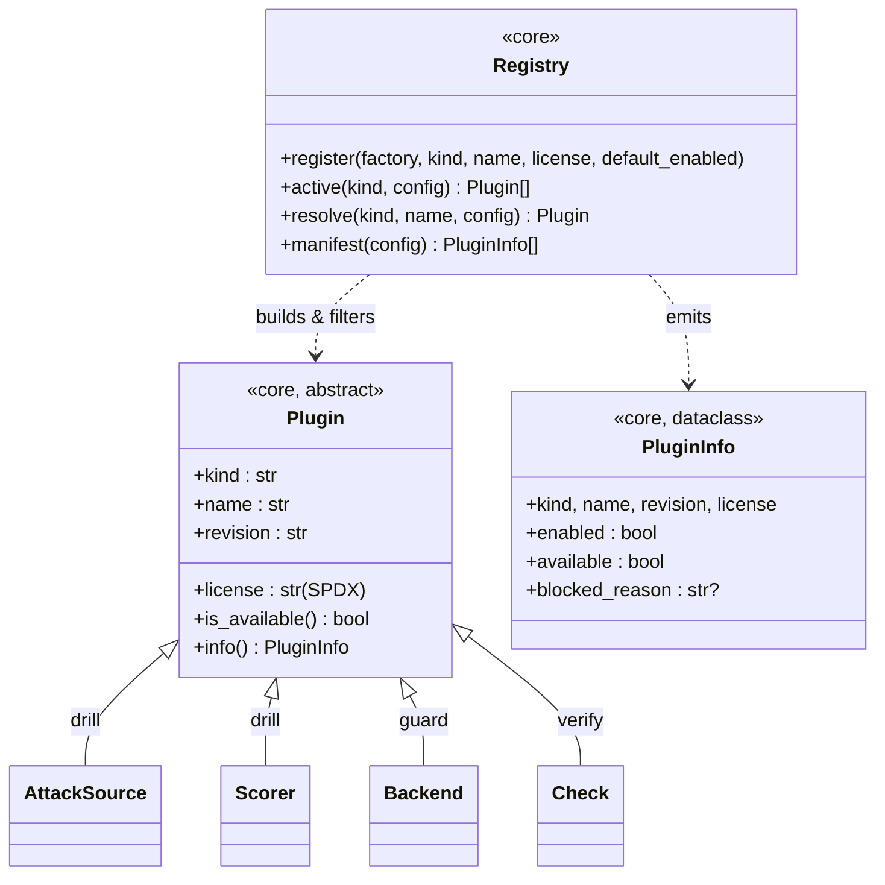

# Plugin Registry — a design start, derived from what Drill needs

> **Approach:** design the registry from its *first real consumer* (Drill), then the dedicated
> cross-cutting session reconciles these requirements with Guard's `backends` and Verify's `checks`
> before building it in `blastcontain-core`. This doc is **input**, not the final design.
>
> Grounded in real code: `corpus/base.py` (`AttackSource`), `scoring/base.py` (`Scorer`),
> `scoring/__init__.py` (`make_guard_scorer`), `corpus/__init__.py` (`load_corpus`),
> `runner.py` (`build_scorers`). Companion to [design.md](design.md) and the plugin-spec.

## 1. What Drill actually does today (the evidence)

Drill already runs an *informal* plugin system. The registry's job is to formalize exactly these
behaviours — no more, no less:

| # | What Drill does today (real code) | → Registry requirement |
|---|---|---|
| R1 | Runs **many** sources at once (`builtin + operators + jbb`) and **many** scorers (`judge + guard + heuristic`) | **Multiple plugins per kind**, not one-per-slot. `active(kind)` returns a **list**. |
| R2 | `load_corpus` / `build_scorers` skip anything whose `is_available()` is False | **Availability is first-class** — `active()` filters out unavailable plugins. |
| R3 | Opt-in flags: `enable_jbb`, `enable_operators`, `enable_aig`, `enable_systemcard`, `enable_multiturn`; always-on base (`builtin`, `heuristic`) | **Config-driven enable/disable** per plugin, with a default-enabled flag. |
| R4 | Signed report records `corpus_sources` as **`name@revision`** (`jailbreakbench@886acc3`) and `scorers` availability flags | **Every plugin declares `name` + `revision`**; the registry emits a **manifest** for provenance. |
| R5 | `make_guard_scorer(id)` picks a guard family by matching the model id (`"wildguard"` → `WildGuardScorer`) | **Resolve-by-name/pattern**: `resolve(kind, name, config) -> plugin`. |
| R6 | Scorers consumed in **authority order** (judge ▸ guard ▸ heuristic) | **Ordering** — registry carries an optional `priority`; the *consumer* decides final order. |
| R7 | Plugins need construction args — a guard needs a `model_id` + a `ChatBackend`; a source needs a data dir / service URL | **Config + factory**: a plugin is built from a config dict via a factory; declares a `config-schema`. |
| R8 | Hard rule: plugins must be **permissively licensed** (Llama-Guard + JAILJUDGE are *blocked*) | **License is declared + gated** — registry refuses/flags non-permissive (`SPDX` id). |
| R9 | Adding JBB/WildGuard meant **editing** `load_corpus` / `make_guard_scorer` to import + wire them | **Self-registration** (decorator) + **entry points**, so a new plugin (or a pip-installed one) needs *no* core edit. |
| R10 | `AttackSource` has `layer` (replay/operators/generative); `Scorer` returns a verdict dict | **Kind-specific interface + metadata** layered on a common base. |

## 2. Proposed core abstractions (draft)

A **marker base** (identity / availability / provenance / license) in `blastcontain-core`; each *kind*
extends it with its own operations. The registry only ever deals in the base.



```python
# blastcontain_core/plugins.py  (the framework — Apache-2.0)

PERMISSIVE = {"Apache-2.0", "MIT", "BSD-2-Clause", "BSD-3-Clause", "ISC", "MPL-2.0"}

class Plugin(Protocol):
    kind: ClassVar[str]          # "attack-source" | "scorer" | "backend" | "check"
    name: str                    # stable id, e.g. "jailbreakbench"
    revision: str                # "886acc3" | "v1"   (R4 — goes in the signed report)
    license: ClassVar[str]       # SPDX id            (R8 — permissive-only gate)
    def is_available(self) -> bool: ...   # R2

@dataclass(frozen=True)
class PluginInfo:                # R4 — manifest row + report provenance
    kind: str; name: str; revision: str; license: str
    enabled: bool; available: bool; blocked_reason: str | None = None
    def tag(self) -> str:        # "jailbreakbench@886acc3"
        return f"{self.name}@{self.revision}"

class Registry:
    def register(self, factory, *, kind, name, license,
                 default_enabled=False, priority=0): ...        # R3,R6,R7,R9

    def active(self, kind: str, config: dict) -> list[Plugin]:  # R1,R2,R3,R6,R8
        # build every enabled plugin of `kind` from config, drop unavailable and
        # license-blocked, return sorted by priority. THE call load_corpus/build_scorers make.

    def resolve(self, kind, name, config) -> Plugin | None: ... # R5

    def manifest(self, config) -> list[PluginInfo]: ...         # R4 — provenance for the report

def register(kind, name, license, **kw):   # R9 — decorator; class self-registers on import
    ...
```

Discovery (R9), two tiers:
- **In-tree:** a `@register(...)` decorator on each plugin class → self-registers on import.
- **Third-party:** Python entry points (`[project.entry-points."blastcontain.plugins"]`) → a
  pip-installed dataset/guard contributes without touching core. (This is how a scout-ratified source,
  or someone else's pack, plugs in.)

## 3. How Drill would use it (before → after)

The point: the registry *removes wiring*, and **provenance comes for free**.

```python
# load_corpus  (corpus/__init__.py)  — BEFORE: hand-assembled + per-source enable flags
sources = [BuiltinReplaySource()]
if enable_operators:  sources.append(OperatorsSource())
if enable_jbb:        sources.append(JailbreakBenchSource())
if enable_systemcard: sources.append(SystemCardSource())
if enable_multiturn:  sources.append(MultiTurnSource())
if enable_aig:        sources.append(AIGAttackSource(...))
# ...filter is_available(), build `name@revision` list by hand...

# AFTER
sources = registry.active("attack-source", cfg)          # R1,R2,R3 — enabled+available, ordered
attacks = [a for s in sources for a in s.dataset(...)]
corpus.sources = [i.tag() for i in registry.manifest(cfg) if i.kind=="attack-source" and i.available]  # R4

# make_guard_scorer  (scoring/__init__.py)  — BEFORE: if "wildguard" in id: ... elif "granite" ...
guard = registry.resolve("scorer", cfg.guard_model, cfg)  # R5

# build_scorers  — BEFORE: judge + guard + heuristic appended by hand, flags dict by hand
scorers = registry.active("scorer", cfg)                  # R1,R2,R6 (priority = authority order)
flags   = {i.name: i.available for i in registry.manifest(cfg) if i.kind=="scorer"}  # R4
```

`AttackSource`/`Scorer` change *minimally* — they already have `name`, `revision`, `is_available()`;
they gain `kind` + `license` class attrs and a `@register(...)` decorator. The runner stops importing
concrete plugins.

## 4. Scope — what Drill does **not** need (keep the first cut small)

- **No management UI.** The provenance manifest is enough for the report; the install/enable/configure
  *screen* is a commercial-GUI piece — defer.
- **No runtime hot-reload / dynamic install.** Registration at import/startup covers every Drill case.
- **No service lifecycle management.** AIG is a service, but the *plugin* (an `AttackSource` adapter)
  just talks to it via `is_available()` + `dataset()`. The registry never starts/stops processes.
- **No per-plugin sandboxing.** The cage already isolates execution; the registry is metadata + wiring.

## 5. Open questions for the dedicated (cross-cutting) session

1. **Generalize, don't Drill-ify.** Do Guard's `backends` and Verify's `checks` fit the same
   `active(kind)` / `resolve(kind, name)` shape, or do they need single-select (one enforcement backend)
   vs Drill's multi-select? → may add a `cardinality` (one vs many) per kind.
2. **Ordering home.** Is `priority` a registry concern, or pure consumer policy? Drill's authority order
   (judge ▸ guard ▸ heuristic) is *Drill's* rule, not universal.
3. **License enforcement strictness.** Hard-block non-permissive at `register()` time, or register +
   flag (`blocked_reason`) and let the consumer decide? (Gated-but-permissive models like WildGuard
   weights complicate "available".)
4. **Config schema.** How rich? A simple `{name: {enabled, ...}}` dict covers Drill; do Guard/Verify
   need typed/validated config (pydantic)?
5. **Where it lives.** `blastcontain_core.plugins` (shared) vs its own `blastcontain-plugins` package.
   Drill-only would be wrong — the whole point is cross-cutting.
6. **Cage & Attacker — plugins or internal strategies?** They're pluggable ABCs but user *picks one*
   (`--cage`, `--attacker-model`), not "installs many." Probably **not** registry citizens (cardinality
   one, no third-party need) — but worth a deliberate call.
```

## TL;DR for the build session

Drill needs a registry that: holds **many plugins per kind**, **filters by availability**, **enables via
config**, **declares `name@revision` + `license`** (manifest → signed report), **resolves by name**
(`make_guard_scorer`), and lets plugins **self-register** so wiring stops living in `load_corpus`. Build
*that* core; defer the UI; reconcile cardinality/ordering with Guard + Verify first.
