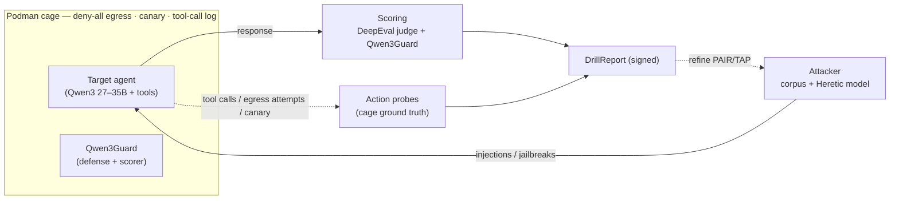

# BlastContain Drill — Adversarial Red-Team Specification

**Drill stress-tests the agent *inside the cage* — and tells you what Verify missed.**
Version 0.1 — Draft | 2026-05-31 | Audience: Engineering

> The cage trilogy: **Verify** proves the cage is built right · **Drill** attacks the agent inside it
> · **Guard** adds the runtime locks. Drill is mostly **orchestration over existing Apache-2.0
> red-team OSS** plus one thing only the cage can do — *action-level* ground truth.
>
> Companion specs: [guard-spec](BlastContain-guard-spec.md), [data-trust-spec](BlastContain-data-trust-spec.md)
> (Qwen3Guard), [charter-spec §7.7](BlastContain-charter-spec.md) (behavioural baseline),
> [roadmap](BlastContain-roadmap.md) (Drill = **P1**). **Status: 🟡 skeleton exists; corpus + scoring ⬜.**

> **Status legend:** ✅ done · 🟡 partial · ⬜ planned · ◇ future

---

## 1. What Drill is

A red-team that runs attack scenarios against a registered agent and produces a signed **DrillReport**
in the Audit-Packet format. Two roles:

- **Role A — red-team (no Charter needed):** attack the agent, observe what it does, *see what you
  missed*. Ships first; the win/lose conditions live in the **test harness**.
- **Role B — prove the controls work (needs Charter + Guard):** attempt a Charter-denied action and
  demonstrate it cannot execute. The closed-loop proof — arrives with P4.

**The distinction that defines Drill:** existing tools score the **model's output** (jailbroken text,
PII in a response). Drill, running the agent **in the cage**, scores the **action** — did the canary
*actually* leave? did a forbidden tool *fire*? did the agent *attempt* an outbound connection Podman
blocked? *Content scoring says "the model said something bad." Drill says "the agent did something
bad."* The second is where what-you-missed actually hides.

## 2. Scope (side-of-desk threat model)

In: prompt injection (direct + indirect), data exfiltration, jailbreak, tool misuse, MCP hijack /
tool poisoning, skill scanning. Deferred to Part Two: multi-agent / delegation-abuse scenarios.

## 3. The local bench

Everything runs on one box (≈48 GB VRAM), no API required:



The agent is driven black-box (over its API / chat loop). Observation is the **cage**: tool-call log,
Podman egress (blocked/attempted connections), and planted canaries.

## 4. The attack corpus — three layers, pluggable & versioned

Drill's attacks are a **living, version-pinned library**, not a fixed list. Three layers of escalating
effort:

| Layer | Source | Catches | Cost |
|---|---|---|---|
| **Replay** | HF jailbreak datasets · AI-Infra-Guard curated sets · CVE-tracked jailbreaks | *known* attacks — a **regression suite** | cheap, reproducible |
| **Operators** | arXiv techniques as transforms — GCG · AutoDAN · PAIR · TAP · crescendo · many-shot · low-resource-language · encoding | known *methods* on fresh seeds | medium |
| **Generative** | a **Heretic / abliterated attacker model** (no refusals) | *novel* jailbreaks the corpus has never seen | compute-heavy |

### 4.1 The local adversarial loop (Generative layer)

Heretic attacker → Qwen3 target in the cage → Qwen3Guard + DeepEval judge → attacker refines
(PAIR/TAP-style) → repeat. A self-contained jailbreak-discovery engine, fully local. **Start with
Replay (ships in a day, a real regression suite); add the loop when you want discovery.**

### 4.2 Sources & leverage (all Apache 2.0 unless noted)

| Source | Role | Local? |
|---|---|---|
| **AI-Infra-Guard** (Tencent) | prompt/jailbreak operators (26+, single/multi-turn) · **MCP & skill scanning** (14 risk categories) · infra fingerprint | ✅ fully local |
| **DeepEval** | judge (G-Eval / LLM-as-judge, point at local Qwen3) · agentic metrics (tool correctness, MCP) · pytest harness | ✅ local-capable |
| **DeepTeam** (DeepEval's red-team sibling) | attack methods / vulnerabilities | verify catalog before relying |
| **HF jailbreak datasets** | Replay corpora | ✅ (mind licenses — some gated) |
| **MITRE ATLAS · AVID · CVE** | known-technique *catalogs* / taxonomy | ✅ |
| **arXiv** | new technique *operators* (freshness) | ✅ |
| **Heretic / abliterated model** | generative attacker | ✅ |
| **Qwen3Guard** | safety/jailbreak classifier — scorer **and** defense-under-test | ✅ |
| **Cisco AI Defense · AGT** | optional augmentation (adversarial suite · PromptDefenseEvaluator) | API / preview — defer |

> Cisco/AGT plug in via the same **availability-flag** pattern as Verify's augmentation — used if
> present, never required.

### 4.3 AI-Infra-Guard integration (the first attack-source plugin)

Confirmed from its `api.md` — a clean fit. **One task endpoint + a poll/result pair** covers all three
uses; the whole plugin is a submit→poll→fetch loop + three body-builders:

```
POST /api/v1/app/taskapi/tasks   {type, content}   -> data.session_id
GET  /api/v1/app/taskapi/status/{id}               -> data.status: pending|running|completed|failed
GET  /api/v1/app/taskapi/result/{id}               -> data: {...results...}
POST /api/v1/app/taskapi/upload                     -> fileUrl   # for MCP archive scans
```

`type` discriminates: **`model_redteam_report`** (jailbreak) · **`mcp_scan`** · **`ai_infra_scan`**.

**Jailbreak — fully local.** Point target + judge at local Qwen3 via `base_url`:

```json
{ "type": "model_redteam_report", "content": {
    "model":      [{ "model": "qwen3",      "base_url": "http://localhost:8000/v1", "token": "x" }],
    "eval_model":  { "model": "qwen3guard", "base_url": "http://localhost:8001/v1", "token": "x" },
    "dataset": { "dataFile": ["JADE-db-v3.0","JailBench-Tiny"], "numPrompts": 100, "randomSeed": 42 },
    "techniques": ["..."] } }
```

- **`dataset.dataFile` = the Replay layer** (built-in: JADE-db-v3.0, JailBench-Tiny,
  ChatGPT-Jailbreak-Prompts, HarmfulEvalBenchmark…) — ready-made, no HF wiring to start.
- **`techniques[]` + custom `prompt` = the Operators layer.**
- **`numPrompts` + `randomSeed` = corpus pinning** → record in the DrillReport (§7) for reproducibility.

**MCP (`mcp_scan`):** `content.prompt` = MCP URL, or upload an archive (`POST /upload` → `fileUrl` →
`content.attachments`). Reusable in Verify MCP-01.

**Content-only — confirms the split (§5).** Jailbreak eval targets a *chat-completion endpoint*, so it
scores the **model's content**; it never touches the agent's tools or the cage. **AIG = content
scoring; Drill's cage probes = action ground truth.** Fuse the two.

**Plugin shape:** an optional `attack-source` (+ `check` for MCP) plugin — availability-flag on the
`:8088` service; standalone fallback = built-in seeds / HF datasets. Heavy (Docker, 4 GB) → run as a
**service, not a pip dep**.

> **Confirm empirically before mapping:** the `result/{id}` JSON's **per-prompt verdict/score fields
> are undocumented** — run one scan, dump the result, map fields → `DrillFinding` (~half a day). Also
> confirm the auth header and headless (API-only) operation on first stand-up.

## 5. Scoring — two planes

A scenario returns **HELD** / **BYPASS** with detection latency + blocker (the existing
`BaseScenario._timed_probe` model in code). Two scoring planes feed it:

| Plane | Asks | How |
|---|---|---|
| **Content** | did the model *say* something bad? | DeepEval judge (local Qwen3) + Qwen3Guard classifier (+ Cisco if present) |
| **Action ★** | did the agent *do* something bad? | **cage ground truth** — canary exfiltrated · forbidden tool fired · egress attempted · tool-call log |

**The Action plane is Drill's value-add — don't outsource it.** Everything else (attacks, content
scoring) is leveraged OSS; the cage's action ground truth is the part only BlastContain has, and it's
already the shape of `base.py`.

## 6. Taxonomy & mapping

Tag every finding with **MITRE ATLAS** (the AI-native ATT&CK — primary), plus MIT AI Risk subdomain
and OWASP Agentic `T#` (consistent with charter-spec §4). ATLAS also gives the corpus a structure:
CVE / arXiv / HF entries hang off ATLAS techniques. (This is the AI-native version of the ATT&CK
mapping on the Zero-Trust horizon list.)

## 7. Corpus versioning & freshness

- **Pin the corpus.** A DrillReport states "tested against corpus `v2026.05`" — reproducible,
  regression-comparable, audit-packet-worthy. The attack corpus is versioned exactly like the
  behavioural golden dataset (charter-spec §7.7).
- **Regression.** Re-run a new agent / Charter version against the pinned corpus; surface new bypasses
  vs the last DrillReport (the existing before/after baseline).
- **Freshness = the point.** arXiv ships new jailbreaks weekly, so Drill needs a **scheduled pull** of
  new techniques / datasets / CVE / ATLAS entries. A stale red-team is theater — this is the Anthropic
  Zero Trust paper's Part V, "defensive ops at the speed of autonomous threats."

## 8. Containment & safety

- **Run the attacker in the cage too.** The Heretic model emits *live* harmful payloads — air-gap it,
  log everything, treat its output as untrusted.
- **The generated-jailbreak corpus is sensitive** — don't leak it; store it like a secret.
- **Check dataset licenses** — some HF jailbreak sets are gated / restricted; record provenance.

## 9. DrillReport

Signed JSON in the Audit-Packet format (attaches to the Ledger). Contents: agent_id · environment ·
**corpus version** · per-scenario HELD/BYPASS · detection latency · blocked-by · **ATLAS coverage** ·
regression delta vs previous · MIT/OWASP tags · SHA-256 signature. CRITICAL bypasses block prod
promotion.

## 10. Plugin framework (cross-cutting — Drill is its first consumer)

> Now specced separately in [BlastContain-plugin-spec.md](BlastContain-plugin-spec.md); summary below.

Drill's attack sources (datasets, operators, the attacker model, guardrail scorers) are **plugins** —
which surfaces a capability BlastContain needs platform-wide (Tenet 6, *pluggable not single-vendor*):

> **A plugin registry + management UI** — install / enable / version / configure extensions: attack
> sources (here), guardrail models (Qwen3Guard / NeMo), enforcement backends (Guard-native / AGT),
> Verify checks & fingerprints, data-trust scanners.

- **Interface (sketch):** a plugin declares `kind` (attack-source · guardrail · backend · check),
  `version`, `config-schema`, and the calls for its kind (e.g. attack-source → `generate(seed,
  technique) -> prompts`; guardrail → `scan(content, direction)`).
- **UI:** a Plugins screen (slots into the GUI wireframes) — enable/disable, version, configure, view
  provenance. **AI-Infra-Guard's plugin framework is a good Apache-2.0 reference to study.**
- **Why together:** Drill *proves* the registry (heavy plugin consumer); the registry makes Drill
  extensible. Build them in the same pass.

## 11. Implementation status & build order

The skeleton has the right shape (`BaseScenario` HELD/BYPASS + latency; 6 scenario stubs; CLI for
black-box `--agent-url`); the **content is unbuilt** ("most scenarios require Phase 7").

Build order (P1):

| # | Step | Leverage |
|---|---|---|
| 1 | **Cage harness** — Qwen3 agent in Podman with a defined toolset (read + a "send" tool + 1–2 MCP tools); deny-all egress; canary; tool-call log | Podman |
| 2 | **Action probes** — canary-exfil / forbidden-tool / egress-attempt detectors | `base.py` model |
| 3 | **Replay layer** — wire AI-Infra-Guard + one HF dataset; run known jailbreaks | AI-Infra-Guard |
| 4 | **Scoring glue** — DeepEval judge (local Qwen3) + Qwen3Guard → combine with action ground truth → HELD/BYPASS/latency | DeepEval, Qwen3Guard |
| 5 | **DrillReport** — signed, corpus-versioned, ATLAS-tagged | — |
| 6 | **Operators** — arXiv-technique transforms | AI-Infra-Guard / custom |
| 7 | **Generative loop** — Heretic attacker + PAIR/TAP refine | Heretic |
| 8 | **Plugin registry + UI** — formalize sources as plugins | AI-Infra-Guard ref |

> Steps 1–5 are a complete, useful Drill (a versioned regression red-team with action ground truth).
> 6–8 are the discovery engine and the platform play.

---

## See also
- [BlastContain-guard-spec.md](BlastContain-guard-spec.md) — Role B proves Guard denies hold
- [BlastContain-data-trust-spec.md](BlastContain-data-trust-spec.md) — Qwen3Guard as a guardrail plugin
- [BlastContain-zero-trust-alignment.md](BlastContain-zero-trust-alignment.md) — ATLAS/ATT&CK mapping, defensive-ops-at-speed
