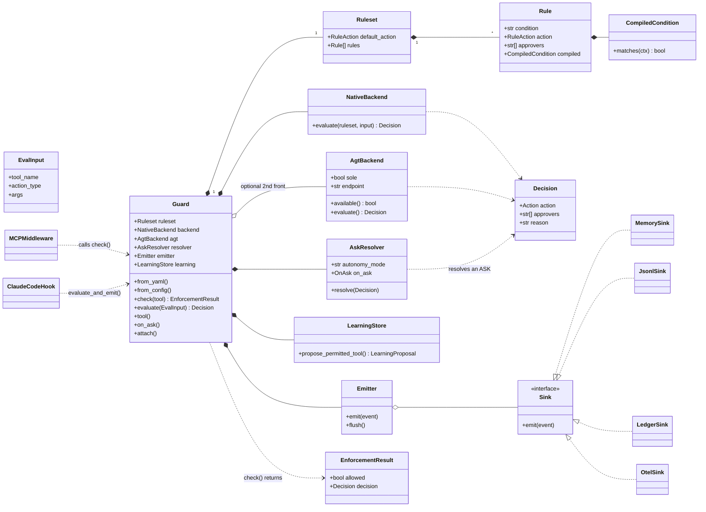

# blastcontain-guard — Architecture

> How the package is structured and *why*. Companion to the
> [guard spec](../../blastcontain/docs/BlastContain-guard-spec.md) (what it does)
> and the [README](README.md) (how to use it). This doc is the *why-it's-shaped-this-way*.

## The one idea everything follows

**Separate *deciding* from *doing*.** A security check is three different jobs:
work out the verdict, possibly ask a human, and write it all down. The whole
codebase is shaped so those three never tangle. Almost every decision below is a
consequence of that.

---

## Module map

| Module | Responsibility | Layer |
|---|---|---|
| `guard.py` | **Guard** — the facade/orchestrator the host holds; wires + runs the pipeline | facade |
| `models.py` | the vocabulary: `Action`, `Decision`, `EvalInput`, `Ask*`, `EnforcementResult`, `DelegationContext` | shared |
| `policy.py` | `Ruleset` → `Rule` — the rulebook (`governance.toolkit/v1`); load + validate | policy |
| `condition.py` | `CompiledCondition` — the safe, **eval-free** expression evaluator | policy |
| `concerns.py` | the named-concern catalog (risk tags: MIT · OWASP) | policy |
| `constants.py` | action taxonomy + `infer_action_type` | policy |
| `evaluator.py` | `evaluate()` — the **pure** decision (first-match, default-deny, delegation) | ① decide |
| `backends/native.py` | `NativeBackend` — always-on in-process primary | ① decide |
| `backends/agt.py` | `AgtBackend` — optional out-of-process 2nd front (HTTP endpoint / `sole` mode) | ① decide |
| `backends/__init__.py` | `combine_with_agt` — stricter-wins + fail-closed in one place | ① decide |
| `ask.py` | `AskResolver` — interactive vs autonomous; the honesty line | ② resolve |
| `learning.py` | `LearningStore` — allow-always → a *proposal* (derive-then-ratify) | ③ record |
| `telemetry.py` | CloudEvents + `Sink`s (memory/jsonl/ledger/otel) + `Emitter`/`AsyncEmitter` | ③ record |
| `reporter.py` | the signed decision-log packet (Audit-Packet envelope) | ③ record |
| `compile.py` | `CharterSchema` → ruleset (offline bridge) | sources |
| `agt_export.py` | `to_agt` / `push_to_agt` — emit + deploy the AGT form of the policy | sources |
| `platform_source.py` | the Platform Charter client — fetch · verify signature · lifecycle gate | sources |
| `config.py` | `GuardConfig` + `load_config` (the mode lives here) | sources |
| `adapters/` | thin translators: `@guard.tool`, `MCPMiddleware`, `ClaudeCodeHook` | adapters |
| `chokepoint.py` | out-of-process policy helpers (egress / MCP gateway / cred broker) | 2nd front |
| `cli.py` | `lint` · `simulate` · `compile` · `export-agt` · `hook` | tooling |
| `errors.py` | `GuardError` / `GuardDenied` (carries the `EnforcementResult`) | shared |

---

## Big picture (layers)

```
┌─ HOST ──────────────────────────────────────────────────────────────────┐
│  your copilot / agent makes a tool call                                  │
└───────────────┬──────────────────────────────────────────────────────────┘
        ADAPTERS │  @guard.tool · MCPMiddleware · ClaudeCodeHook
        (thin translators: a host's tool-call dialect → guard.check)
┌─ FACADE ──────▼──────────────────────────────────────────────────────────┐
│  Guard       the ONE object the host holds; wires + runs the pipeline     │
└──┬─────────────────────────┬────────────────────────────┬────────────────┘
   │ ① DECIDE (pure)          │ ② RESOLVE (ask)            │ ③ RECORD (effects)
   ▼                          ▼                            ▼
 evaluator.evaluate()       AskResolver                  Emitter → Sinks
 NativeBackend              on_ask (human) /             (memory/jsonl/ledger/otel)
 AgtBackend (optional)      autonomous escalate          LearningStore · signed log
   │
   ▼
┌─ POLICY ──────────────────────────────────────────────────────────────────┐
│  Ruleset → Rule → CompiledCondition   (safe, eval-free; DATA, not code)     │
└──────────────────────────────▲─────────────────────────────────────────────┘
        from_yaml · from_charter_file(compile) · from_config · from_charter(Platform)
```

---

## Class structure



---

## One `check()` call, start to finish

```
guard.check("delete_invoice", action_type="delete")
   ① build EvalInput  (the question)
   ② DECIDE — NativeBackend.evaluate(ruleset, input)            ← pure, sub-ms, no I/O
        first Rule whose CompiledCondition matches → Decision
        (+ AgtBackend via combine_with_agt, if enabled)
        → Decision(action=ASK, approvers=[self], reason, risk)
   ③ RESOLVE — only if ASK:
        interactive → on_ask(AskRequest) → AskResult(allow once/always/deny)
        autonomous  → escalate / timeout → deny
        allow-always → LearningStore.propose(...)
   ④ RECORD — Emitter.emit(event) → Sinks (async if networked)
   → EnforcementResult(allowed, decision, ask_result, learning, latency)
```

---

## Why it's coded this way

**1. One object you hold (`Guard`), everything else hidden.**
You import `Guard`, call `check()` or add `@guard.tool`, done. The wiring (policy,
the AGT second front, telemetry threads) is assembled once and tucked away.
*Like a thermostat: you set a temperature; you don't wire the furnace.*

**2. The verdict is a pure function, walled off from side-effects.**
`evaluate()` takes a question and returns allow/ask/deny — no network, no files,
no prompts. That's why it's sub-millisecond, why it's exhaustively unit-tested
(feed inputs, assert verdicts), and why a telemetry outage or a slow Ledger can
never change a security decision. *The judge decides; the bailiff enforces; the
court reporter writes it down — three different people. If the reporter's pen
breaks, the verdict still stands.*

**3. Policy is data in a file, not logic in the code (`Ruleset`/`Rule`).**
The rules live in a YAML you can read, diff, sign, and hand to AGT — not buried
in Python. *The rulebook is a printed document anyone can amend, not secret
wiring inside the machine.* This is also the open-core wedge: the same file is
the standalone product and the thing the Platform compiles to.

**4. Rule conditions run in a tiny *safe* language, never `eval()` (`CompiledCondition`).**
Rules contain expressions like `action.type == 'delete'`. The lazy way is
Python's `eval()` — but then your *policy file* could run arbitrary code, exactly
the vulnerability Guard's sibling tool flags as CODE-01. So we parse the
expression and permit only comparisons, and/or, and literals. *We let the
rulebook do arithmetic and comparisons, but never pick up a chainsaw.* Bonus: a
broken rule fails when you load the file, not at 3am mid-request.

**5. The two fronts are pluggable, and combining them lives in one place.**
Native always works in-process; AGT is an optional out-of-process second opinion.
The merge rule — *stricter wins, and if AGT is unreachable, fail closed* — sits
in a single function (`combine_with_agt`), so it can't go inconsistent. `dual` vs
`sole` is just config of this same machinery. *A lock on your door (always there)
plus an optional lobby guard; if the guard's asleep, you keep the door locked.*

**6. Asking a human is a callback, not built-in UI (`on_ask` / `AskResolver`).**
Guard can't know if the host is a terminal, an IDE, a chat app, or an unattended
server. So when the verdict is "ask," it hands the question to *your* UI via a
callback and waits. The same Guard runs interactive or autonomous — only
`autonomy_mode` (a config) changes how an "ask" resolves. *Guard decides a human
must sign off; it rings your doorbell and waits — it doesn't care what your door
looks like.*

**7. Recording fans out to swappable "sinks," off the hot path (`Emitter`/`Sink`).**
Every decision is an event sent to any number of destinations (memory, file,
Ledger, OpenTelemetry); the networked ones run on a background thread so logging
never slows a decision. Adding a destination means writing one small `Sink` —
nothing else changes. *The court reporter sits in the back; if they're slow, the
trial doesn't wait.*

**8. Learning *proposes*, humans *ratify* (`LearningStore`).**
When a user clicks "allow always," Guard records a *suggestion* to widen the
rulebook — it never edits its own rules. *The assistant can suggest a new house
rule; only you sign it in.* (The platform's founding principle — derive, then
ratify.)

**9. Adapters are thin translators (`MCPMiddleware`, `ClaudeCodeHook`, the decorator).**
Each host speaks a different "tool call" dialect. An adapter only converts that
dialect into a `guard.check()` and converts the verdict back. The core never
learns about any specific framework. *Travel plug adapters: the appliance is the
same; the adapter fits the local socket.*

**10. Where policy comes from is a *construction* choice.**
Hand-written YAML, a compiled Charter, or a Platform pull
(`from_yaml`/`from_config`/`from_charter_file`/`from_charter`) — different front
doors, identical machine behind them. *Fill the tank from a can, a pump, or a
tanker; the engine runs the same.*

---

## Tradeoffs worth debating

- **Safe mini-language vs. a real policy engine (OPA/Rego/Cedar).** Simpler and
  dependency-free, but less expressive. When is the DSL too limited?
- **Guard owns the decision; AGT only tightens — except in `sole` mode**, where
  AGT can *loosen* (override a native deny). Is `sole` a footgun we should make
  harder to select?
- **Telemetry buffered in-memory to build the signed log.** Long-running agents
  accumulate events. Should the buffer be bounded / periodically flushed?
- **Decision models live in Guard, not in `core`.** Keeps Guard standalone, but
  the Ledger ingests a raw dict instead of a shared type. Promote to `core`?
- **The Claude Code hook fails *open* on a parse error** so a broken integration
  can't brick the editor — but a security control failing open is arguable.

---

## See also
- [BlastContain-guard-spec.md](../../blastcontain/docs/BlastContain-guard-spec.md) — the specification
- [README.md](README.md) — usage, the three config-driven modes
- [examples/](examples/) — `agent.py` + `mode-*.yaml` + `demo_agt_server.py`
