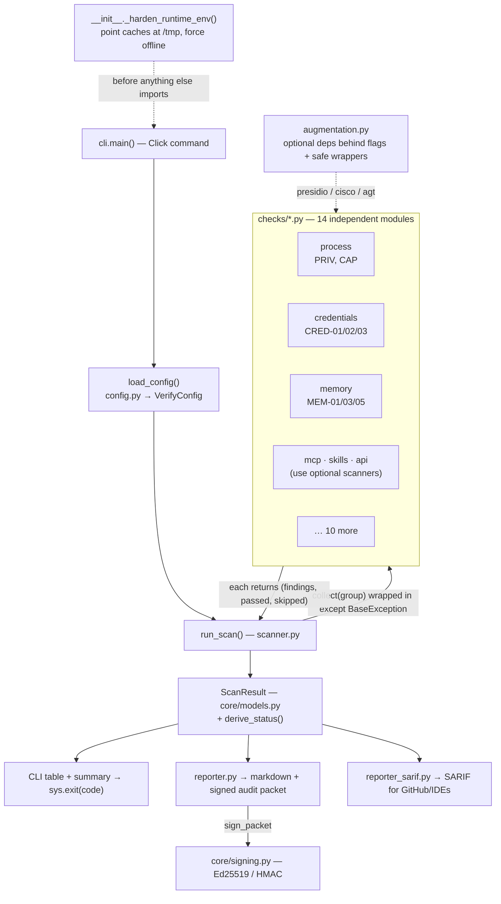
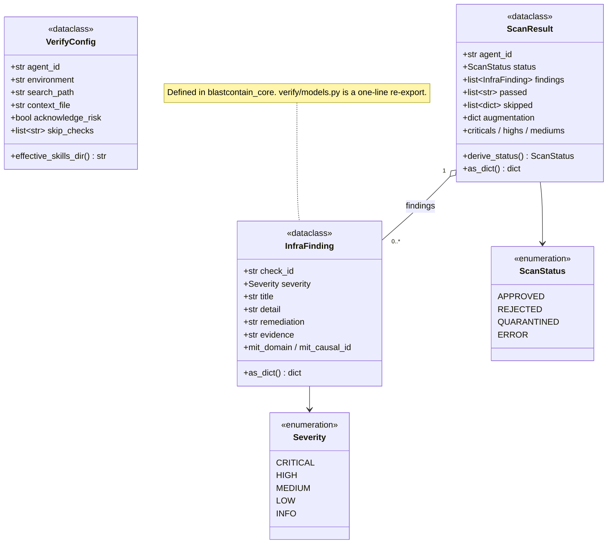
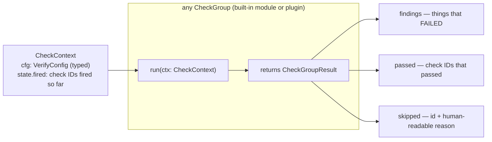

# BlastContain Verify — Architecture & Design Notes

A companion to [`spec.md`](spec.md). The spec says *what each check does*; this
doc explains *how the program is shaped and why*, in plain language, as a basis
for design discussion. Diagrams are [Mermaid](https://mermaid.js.org) — they
render in GitHub, VS Code, and Obsidian.

> TL;DR: `verify` is a **functional pipeline**, not an object hierarchy. A thin
> CLI builds a config, an orchestrator walks ~27 independent check functions,
> each reports into one of three buckets, and the collected facts become a
> `ScanResult` that separate "printers" render. The few real classes are plain
> data containers. Everything fragile (ML models, third-party scanners) is
> quarantined behind one module so the scan **degrades instead of crashing**.

---

## 1. The shape of the system

```
__init__._harden_runtime_env()   ← runs first, prepares the offline/read-only environment
        │
   cli.main()  ──►  load_config()  ──►  run_scan()  ──►  ScanResult  ──►  reporters + exit code
   (Click)          (config.py)        (scanner.py)      (core/models)     (reporter*.py)
                                            │
                                   14 check modules (checks/*.py)
                                            │
                                   augmentation.py  ← optional deps (presidio, cisco, agt)
```

Three things to hold onto: (1) the checks are independent and uniform, (2) the
data types are shared with the rest of BlastContain via `blastcontain_core`, and
(3) resilience is a first-class design goal, not an afterthought.

---

## 2. View — how a scan flows (the pipeline)



**Walkthrough.** `_harden_runtime_env()` runs at import (earliest possible
moment) to make the container's offline, read-only environment safe for the ML
libraries. The Click `main()` merges a YAML config with CLI flags into a
`VerifyConfig`. `run_scan()` calls each check group through `collect()`, which
wraps it in `except BaseException` so a single crash becomes a synthetic
`SCAN-<GROUP>` finding instead of killing the run. The collected facts become a
`ScanResult`; `derive_status()` turns severities into an overall verdict; and
separate reporters render Markdown, a signed JSON audit packet, and SARIF. The
process exit code encodes the verdict (0 APPROVED · 1 REJECTED · 2 QUARANTINED ·
3 ERROR), unless `--acknowledge-risk` forces 0.

---

## 3. View — the data model (the real classes)

The only true classes are **data containers** — dataclasses + enums. No behavior
hierarchy.



---

## 4. View — the check contract (typed, registry-driven since 0.4.0)

Every check group satisfies the `CheckGroup` protocol defined in
[`contract.py`](../blastcontain_verify/contract.py) — a deliberate leaf module
(types only) so groups can import it without cycles. The ordered inventory
lives in [`registry.py`](../blastcontain_verify/registry.py); third parties add
groups via the `blastcontain_verify.checks` entry point ([plugin guide](plugins.md)).



`scanner.py` iterates `BUILTIN_GROUPS` + discovered plugins in registry order
(order is load-bearing: environment runs before memory so MEM-05 can read
ENV-02 from `ScanState.fired`). Each group declares `provides` — the check IDs
it owns — enforced unique across the registry, and asserted equal to
`constants.ALL_CHECK_IDS` by the drift tests.

| Module (`checks/`) | Checks | Notable inputs |
|---|---|---|
| `process` | PRIV-01, CAP-01 | — |
| `environment` | ENV-01, ENV-02, ENV-03 | `model_dir`, `egress_probe_target` |
| `filesystem` | DISK-01, DISK-02 | `environment` |
| `credentials` | CRED-01, CRED-02, CRED-03 | `search_path` |
| `network` | NET-01, NET-02 | `egress_probe_target` |
| `persistence` | PERM-01 | — |
| `memory` | MEM-01, MEM-03, MEM-05 | `context_file`, `env02_fired` |
| `skills` | SKILL-01, SKILL-02 | `skills_dir` (+ Cisco scanner) |
| `api` | API-01, API-02 | `api_spec`, `live_probe` |
| `mcp` | MCP-01, MCP-02, MCP-03 | `mcp_config` (+ Cisco scanner) |
| `code` | CODE-01 | `search_path` |
| `supply_chain` | SUP-01 | `model_dir` |
| `tls` | TLS-01 | `search_path` |
| `local` | LOCAL-01 | — |

*(MEM-05 is composite: `scanner.py` computes `env02_fired` from the environment
group's result and feeds it to `memory.run()`.)*

---

## 5. Why it's coded this way (plain-English)

**1. Checks are simple groups behind one typed contract, not a class hierarchy.**
Like an airport with independent screening stations — X-ray, metal detector,
passport desk. Each does one job and stamps "pass / flagged / not-applicable."
They share a *contract*, not machinery: `run(ctx) -> CheckGroupResult`, where
`ctx.cfg` gives typed access to the config (a renamed field is a type error at
the read site, not a silently-defaulted kwarg). The registry makes the
inventory explicit and lets organizations add their own groups via entry
points instead of forking.

**2. Every check reports into three buckets: failed / passed / skipped.**
In compliance, *silence is dangerous* — a check that quietly didn't run looks
identical to one that passed. So a check can never "say nothing"; it lands in one
bucket, and **skipped carries a reason**. That's the difference between "we
looked and it's clean" and "we never looked."

**3. One broken check can't sink the scan (`collect()` + `except BaseException`).**
Like a panel that logs "sensor 4 offline" and keeps the others live instead of
going dark. A crash becomes a synthetic `SCAN-<GROUP>` finding and the scan still
produces a signed record. A scanner that dies with no output is worse than
useless.

**4. The scary/heavy dependencies live in one quarantine room (`augmentation.py`).**
The ML models and third-party scanners are "power tools" — heavy, flaky,
sometimes absent. They sit in one cabinet with one keyholder; the rest of the
code asks *"is presidio available? if so analyze, else hand me the regex."* A
missing or broken tool degrades the result instead of breaking the house. **This
is the backbone of graceful degradation** — and what the recent hardened-container
fix reinforced.

**5. The result types live in `blastcontain_core`, shared by everyone.**
Verify, Drill, and the platform must agree on what a "finding" *is*. Define
`InfraFinding`/`ScanResult` once; everyone imports the same definition; no
translation code that drifts. `verify/models.py` is a one-line re-export so
verify code keeps its short imports.

**6. "Gather evidence" is separate from "render the verdict" (`derive_status`).**
Checks report facts; a separate step turns severities into APPROVED / REJECTED /
QUARANTINED. Jury vs. judge — change the verdict *policy* without editing 27
checks.

**7. Producing facts is separate from printing them (reporters).**
One `ScanResult`, three renderers: Markdown for humans, a signed JSON packet for
the audit trail, SARIF for GitHub/IDEs. Same content, different printers — add a
format without touching scan logic.

**8. The environment is prepped before any appliance powers on (`_harden_runtime_env`).**
Some libraries reach for the network and `~/.cache` the instant they import. So
we set the kitchen up first — caches → writable `/tmp`, phone-home unplugged —
*before* switching anything on. It lives in `__init__.py` because that's the
earliest moment, before the optional deps load.

---

## 6. Design tensions / open questions (let's discuss)

- ~~**Convention vs. enforced contract for checks.**~~ **Resolved (0.4.0):**
  `contract.py` defines the `CheckGroup` protocol + typed `CheckContext`;
  `registry.py` holds the explicit inventory and entry-point plugin discovery.
  The `**kwargs` dispatch is gone with it.
- **The optimistic `PRESIDIO_AVAILABLE` flag.** It is `True` the moment the
  package imports and only flips to `False` after the first failed use — so the
  banner can advertise "presidio active" and *then* fall back to regex. Honest
  enough, or misleading?
- **Unpinned `[full]` extras.** Exactly what caused the bug we just fixed —
  different machines resolve different ML-lib versions. Pin for reproducibility,
  or keep open for easy upgrades?
- **The `models.py` re-export shim.** Convenience (verify code unchanged) vs.
  indirection (one more hop to find the real definition).

---

*Cross-reference: the concrete, dated design decisions are catalogued in
[`spec.md` §10 Decisions](spec.md). This doc is the narrative companion — keep
the two in sync when the architecture changes.*
